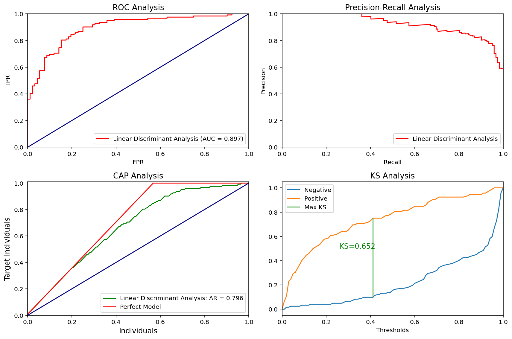
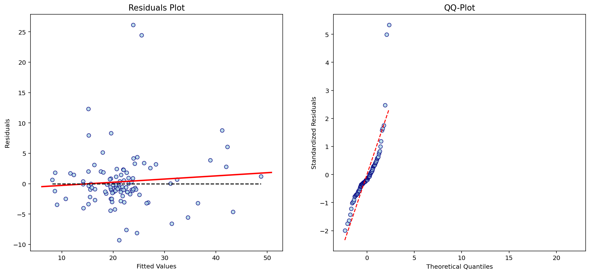

### AUTOML

This is a library developed to incorporate useful properties and methods in relevant data science packages, such as **scikit-learn** and **pycaret**, in order to provide a pipeline which suits every supervised problem. Therefore, data scientists can spend less time working on building pipelines and use this time more wisely to create new features and tune the best model.


```python
import numpy as np
import pandas as pd
import matplotlib.pyplot as plt

from sklearn.model_selection import train_test_split
```

### 1 - Classification


```python
df = pd.read_csv("juice.csv")
```


```python
df.head()
```


<div>
<style scoped>
    .dataframe tbody tr th:only-of-type {
        vertical-align: middle;
    }

    .dataframe tbody tr th {
        vertical-align: top;
    }

    .dataframe thead th {
        text-align: right;
    }
</style>
<table border="1" class="dataframe">
  <thead>
    <tr style="text-align: right;">
      <th></th>
      <th>Id</th>
      <th>Purchase</th>
      <th>WeekofPurchase</th>
      <th>StoreID</th>
      <th>PriceCH</th>
      <th>PriceMM</th>
      <th>DiscCH</th>
      <th>DiscMM</th>
      <th>SpecialCH</th>
      <th>SpecialMM</th>
      <th>LoyalCH</th>
      <th>SalePriceMM</th>
      <th>SalePriceCH</th>
      <th>PriceDiff</th>
      <th>Store7</th>
      <th>PctDiscMM</th>
      <th>PctDiscCH</th>
      <th>ListPriceDiff</th>
      <th>STORE</th>
    </tr>
  </thead>
  <tbody>
    <tr>
      <td>0</td>
      <td>1</td>
      <td>CH</td>
      <td>237</td>
      <td>1</td>
      <td>1.75</td>
      <td>1.99</td>
      <td>0.00</td>
      <td>0.0</td>
      <td>0</td>
      <td>0</td>
      <td>0.500000</td>
      <td>1.99</td>
      <td>1.75</td>
      <td>0.24</td>
      <td>No</td>
      <td>0.000000</td>
      <td>0.000000</td>
      <td>0.24</td>
      <td>1</td>
    </tr>
    <tr>
      <td>1</td>
      <td>2</td>
      <td>CH</td>
      <td>239</td>
      <td>1</td>
      <td>1.75</td>
      <td>1.99</td>
      <td>0.00</td>
      <td>0.3</td>
      <td>0</td>
      <td>1</td>
      <td>0.600000</td>
      <td>1.69</td>
      <td>1.75</td>
      <td>-0.06</td>
      <td>No</td>
      <td>0.150754</td>
      <td>0.000000</td>
      <td>0.24</td>
      <td>1</td>
    </tr>
    <tr>
      <td>2</td>
      <td>3</td>
      <td>CH</td>
      <td>245</td>
      <td>1</td>
      <td>1.86</td>
      <td>2.09</td>
      <td>0.17</td>
      <td>0.0</td>
      <td>0</td>
      <td>0</td>
      <td>0.680000</td>
      <td>2.09</td>
      <td>1.69</td>
      <td>0.40</td>
      <td>No</td>
      <td>0.000000</td>
      <td>0.091398</td>
      <td>0.23</td>
      <td>1</td>
    </tr>
    <tr>
      <td>3</td>
      <td>4</td>
      <td>MM</td>
      <td>227</td>
      <td>1</td>
      <td>1.69</td>
      <td>1.69</td>
      <td>0.00</td>
      <td>0.0</td>
      <td>0</td>
      <td>0</td>
      <td>0.400000</td>
      <td>1.69</td>
      <td>1.69</td>
      <td>0.00</td>
      <td>No</td>
      <td>0.000000</td>
      <td>0.000000</td>
      <td>0.00</td>
      <td>1</td>
    </tr>
    <tr>
      <td>4</td>
      <td>5</td>
      <td>CH</td>
      <td>228</td>
      <td>7</td>
      <td>1.69</td>
      <td>1.69</td>
      <td>0.00</td>
      <td>0.0</td>
      <td>0</td>
      <td>0</td>
      <td>0.956535</td>
      <td>1.69</td>
      <td>1.69</td>
      <td>0.00</td>
      <td>Yes</td>
      <td>0.000000</td>
      <td>0.000000</td>
      <td>0.00</td>
      <td>0</td>
    </tr>
  </tbody>
</table>
</div>


```python
X = df.iloc[:, 2:]
y = df.iloc[:, 1].apply(lambda x: 1 if x=="CH" else 0)
```


```python
train_X, test_X, train_y, test_y = train_test_split(X, y, test_size=0.2, random_state=0)
```

Importing our class for classification problems


```python
from automl.classification import ClassifierPyCaret
```

Defining object


```python
my_clf = ClassifierPyCaret(metric="AUC")
```

Training all models and selecting the one with best performance


```python
my_clf.fit(train_X, train_y)
```


<style  type="text/css" >
    #T_1b86d472_9b8a_11ea_a256_acde48001122 th {
          text-align: left;
    }    #T_1b86d472_9b8a_11ea_a256_acde48001122row0_col0 {
            text-align:  left;
        }    #T_1b86d472_9b8a_11ea_a256_acde48001122row0_col1 {
            : ;
            text-align:  left;
        }    #T_1b86d472_9b8a_11ea_a256_acde48001122row0_col2 {
            background-color:  yellow;
            text-align:  left;
        }    #T_1b86d472_9b8a_11ea_a256_acde48001122row0_col3 {
            : ;
            text-align:  left;
        }    #T_1b86d472_9b8a_11ea_a256_acde48001122row0_col4 {
            : ;
            text-align:  left;
        }    #T_1b86d472_9b8a_11ea_a256_acde48001122row0_col5 {
            : ;
            text-align:  left;
        }    #T_1b86d472_9b8a_11ea_a256_acde48001122row0_col6 {
            : ;
            text-align:  left;
        }    #T_1b86d472_9b8a_11ea_a256_acde48001122row1_col0 {
            text-align:  left;
        }    #T_1b86d472_9b8a_11ea_a256_acde48001122row1_col1 {
            background-color:  yellow;
            text-align:  left;
        }    #T_1b86d472_9b8a_11ea_a256_acde48001122row1_col2 {
            : ;
            text-align:  left;
        }    #T_1b86d472_9b8a_11ea_a256_acde48001122row1_col3 {
            background-color:  yellow;
            text-align:  left;
        }    #T_1b86d472_9b8a_11ea_a256_acde48001122row1_col4 {
            : ;
            text-align:  left;
        }    #T_1b86d472_9b8a_11ea_a256_acde48001122row1_col5 {
            background-color:  yellow;
            text-align:  left;
        }    #T_1b86d472_9b8a_11ea_a256_acde48001122row1_col6 {
            : ;
            text-align:  left;
        }    #T_1b86d472_9b8a_11ea_a256_acde48001122row2_col0 {
            text-align:  left;
        }    #T_1b86d472_9b8a_11ea_a256_acde48001122row2_col1 {
            : ;
            text-align:  left;
        }    #T_1b86d472_9b8a_11ea_a256_acde48001122row2_col2 {
            : ;
            text-align:  left;
        }    #T_1b86d472_9b8a_11ea_a256_acde48001122row2_col3 {
            : ;
            text-align:  left;
        }    #T_1b86d472_9b8a_11ea_a256_acde48001122row2_col4 {
            : ;
            text-align:  left;
        }    #T_1b86d472_9b8a_11ea_a256_acde48001122row2_col5 {
            : ;
            text-align:  left;
        }    #T_1b86d472_9b8a_11ea_a256_acde48001122row2_col6 {
            : ;
            text-align:  left;
        }    #T_1b86d472_9b8a_11ea_a256_acde48001122row3_col0 {
            text-align:  left;
        }    #T_1b86d472_9b8a_11ea_a256_acde48001122row3_col1 {
            : ;
            text-align:  left;
        }    #T_1b86d472_9b8a_11ea_a256_acde48001122row3_col2 {
            : ;
            text-align:  left;
        }    #T_1b86d472_9b8a_11ea_a256_acde48001122row3_col3 {
            : ;
            text-align:  left;
        }    #T_1b86d472_9b8a_11ea_a256_acde48001122row3_col4 {
            : ;
            text-align:  left;
        }    #T_1b86d472_9b8a_11ea_a256_acde48001122row3_col5 {
            : ;
            text-align:  left;
        }    #T_1b86d472_9b8a_11ea_a256_acde48001122row3_col6 {
            : ;
            text-align:  left;
        }    #T_1b86d472_9b8a_11ea_a256_acde48001122row4_col0 {
            text-align:  left;
        }    #T_1b86d472_9b8a_11ea_a256_acde48001122row4_col1 {
            : ;
            text-align:  left;
        }    #T_1b86d472_9b8a_11ea_a256_acde48001122row4_col2 {
            : ;
            text-align:  left;
        }    #T_1b86d472_9b8a_11ea_a256_acde48001122row4_col3 {
            : ;
            text-align:  left;
        }    #T_1b86d472_9b8a_11ea_a256_acde48001122row4_col4 {
            : ;
            text-align:  left;
        }    #T_1b86d472_9b8a_11ea_a256_acde48001122row4_col5 {
            : ;
            text-align:  left;
        }    #T_1b86d472_9b8a_11ea_a256_acde48001122row4_col6 {
            : ;
            text-align:  left;
        }    #T_1b86d472_9b8a_11ea_a256_acde48001122row5_col0 {
            text-align:  left;
        }    #T_1b86d472_9b8a_11ea_a256_acde48001122row5_col1 {
            : ;
            text-align:  left;
        }    #T_1b86d472_9b8a_11ea_a256_acde48001122row5_col2 {
            : ;
            text-align:  left;
        }    #T_1b86d472_9b8a_11ea_a256_acde48001122row5_col3 {
            : ;
            text-align:  left;
        }    #T_1b86d472_9b8a_11ea_a256_acde48001122row5_col4 {
            : ;
            text-align:  left;
        }    #T_1b86d472_9b8a_11ea_a256_acde48001122row5_col5 {
            : ;
            text-align:  left;
        }    #T_1b86d472_9b8a_11ea_a256_acde48001122row5_col6 {
            : ;
            text-align:  left;
        }    #T_1b86d472_9b8a_11ea_a256_acde48001122row6_col0 {
            text-align:  left;
        }    #T_1b86d472_9b8a_11ea_a256_acde48001122row6_col1 {
            : ;
            text-align:  left;
        }    #T_1b86d472_9b8a_11ea_a256_acde48001122row6_col2 {
            : ;
            text-align:  left;
        }    #T_1b86d472_9b8a_11ea_a256_acde48001122row6_col3 {
            background-color:  yellow;
            text-align:  left;
        }    #T_1b86d472_9b8a_11ea_a256_acde48001122row6_col4 {
            : ;
            text-align:  left;
        }    #T_1b86d472_9b8a_11ea_a256_acde48001122row6_col5 {
            : ;
            text-align:  left;
        }    #T_1b86d472_9b8a_11ea_a256_acde48001122row6_col6 {
            : ;
            text-align:  left;
        }    #T_1b86d472_9b8a_11ea_a256_acde48001122row7_col0 {
            text-align:  left;
        }    #T_1b86d472_9b8a_11ea_a256_acde48001122row7_col1 {
            : ;
            text-align:  left;
        }    #T_1b86d472_9b8a_11ea_a256_acde48001122row7_col2 {
            : ;
            text-align:  left;
        }    #T_1b86d472_9b8a_11ea_a256_acde48001122row7_col3 {
            : ;
            text-align:  left;
        }    #T_1b86d472_9b8a_11ea_a256_acde48001122row7_col4 {
            : ;
            text-align:  left;
        }    #T_1b86d472_9b8a_11ea_a256_acde48001122row7_col5 {
            : ;
            text-align:  left;
        }    #T_1b86d472_9b8a_11ea_a256_acde48001122row7_col6 {
            : ;
            text-align:  left;
        }    #T_1b86d472_9b8a_11ea_a256_acde48001122row8_col0 {
            text-align:  left;
        }    #T_1b86d472_9b8a_11ea_a256_acde48001122row8_col1 {
            : ;
            text-align:  left;
        }    #T_1b86d472_9b8a_11ea_a256_acde48001122row8_col2 {
            : ;
            text-align:  left;
        }    #T_1b86d472_9b8a_11ea_a256_acde48001122row8_col3 {
            : ;
            text-align:  left;
        }    #T_1b86d472_9b8a_11ea_a256_acde48001122row8_col4 {
            : ;
            text-align:  left;
        }    #T_1b86d472_9b8a_11ea_a256_acde48001122row8_col5 {
            : ;
            text-align:  left;
        }    #T_1b86d472_9b8a_11ea_a256_acde48001122row8_col6 {
            : ;
            text-align:  left;
        }    #T_1b86d472_9b8a_11ea_a256_acde48001122row9_col0 {
            text-align:  left;
        }    #T_1b86d472_9b8a_11ea_a256_acde48001122row9_col1 {
            : ;
            text-align:  left;
        }    #T_1b86d472_9b8a_11ea_a256_acde48001122row9_col2 {
            : ;
            text-align:  left;
        }    #T_1b86d472_9b8a_11ea_a256_acde48001122row9_col3 {
            : ;
            text-align:  left;
        }    #T_1b86d472_9b8a_11ea_a256_acde48001122row9_col4 {
            : ;
            text-align:  left;
        }    #T_1b86d472_9b8a_11ea_a256_acde48001122row9_col5 {
            : ;
            text-align:  left;
        }    #T_1b86d472_9b8a_11ea_a256_acde48001122row9_col6 {
            : ;
            text-align:  left;
        }    #T_1b86d472_9b8a_11ea_a256_acde48001122row10_col0 {
            text-align:  left;
        }    #T_1b86d472_9b8a_11ea_a256_acde48001122row10_col1 {
            : ;
            text-align:  left;
        }    #T_1b86d472_9b8a_11ea_a256_acde48001122row10_col2 {
            : ;
            text-align:  left;
        }    #T_1b86d472_9b8a_11ea_a256_acde48001122row10_col3 {
            : ;
            text-align:  left;
        }    #T_1b86d472_9b8a_11ea_a256_acde48001122row10_col4 {
            : ;
            text-align:  left;
        }    #T_1b86d472_9b8a_11ea_a256_acde48001122row10_col5 {
            : ;
            text-align:  left;
        }    #T_1b86d472_9b8a_11ea_a256_acde48001122row10_col6 {
            : ;
            text-align:  left;
        }    #T_1b86d472_9b8a_11ea_a256_acde48001122row11_col0 {
            text-align:  left;
        }    #T_1b86d472_9b8a_11ea_a256_acde48001122row11_col1 {
            : ;
            text-align:  left;
        }    #T_1b86d472_9b8a_11ea_a256_acde48001122row11_col2 {
            : ;
            text-align:  left;
        }    #T_1b86d472_9b8a_11ea_a256_acde48001122row11_col3 {
            : ;
            text-align:  left;
        }    #T_1b86d472_9b8a_11ea_a256_acde48001122row11_col4 {
            : ;
            text-align:  left;
        }    #T_1b86d472_9b8a_11ea_a256_acde48001122row11_col5 {
            : ;
            text-align:  left;
        }    #T_1b86d472_9b8a_11ea_a256_acde48001122row11_col6 {
            : ;
            text-align:  left;
        }    #T_1b86d472_9b8a_11ea_a256_acde48001122row12_col0 {
            text-align:  left;
        }    #T_1b86d472_9b8a_11ea_a256_acde48001122row12_col1 {
            : ;
            text-align:  left;
        }    #T_1b86d472_9b8a_11ea_a256_acde48001122row12_col2 {
            : ;
            text-align:  left;
        }    #T_1b86d472_9b8a_11ea_a256_acde48001122row12_col3 {
            : ;
            text-align:  left;
        }    #T_1b86d472_9b8a_11ea_a256_acde48001122row12_col4 {
            : ;
            text-align:  left;
        }    #T_1b86d472_9b8a_11ea_a256_acde48001122row12_col5 {
            : ;
            text-align:  left;
        }    #T_1b86d472_9b8a_11ea_a256_acde48001122row12_col6 {
            : ;
            text-align:  left;
        }    #T_1b86d472_9b8a_11ea_a256_acde48001122row13_col0 {
            text-align:  left;
        }    #T_1b86d472_9b8a_11ea_a256_acde48001122row13_col1 {
            : ;
            text-align:  left;
        }    #T_1b86d472_9b8a_11ea_a256_acde48001122row13_col2 {
            : ;
            text-align:  left;
        }    #T_1b86d472_9b8a_11ea_a256_acde48001122row13_col3 {
            : ;
            text-align:  left;
        }    #T_1b86d472_9b8a_11ea_a256_acde48001122row13_col4 {
            : ;
            text-align:  left;
        }    #T_1b86d472_9b8a_11ea_a256_acde48001122row13_col5 {
            : ;
            text-align:  left;
        }    #T_1b86d472_9b8a_11ea_a256_acde48001122row13_col6 {
            : ;
            text-align:  left;
        }    #T_1b86d472_9b8a_11ea_a256_acde48001122row14_col0 {
            text-align:  left;
        }    #T_1b86d472_9b8a_11ea_a256_acde48001122row14_col1 {
            background-color:  yellow;
            text-align:  left;
        }    #T_1b86d472_9b8a_11ea_a256_acde48001122row14_col2 {
            : ;
            text-align:  left;
        }    #T_1b86d472_9b8a_11ea_a256_acde48001122row14_col3 {
            : ;
            text-align:  left;
        }    #T_1b86d472_9b8a_11ea_a256_acde48001122row14_col4 {
            background-color:  yellow;
            text-align:  left;
        }    #T_1b86d472_9b8a_11ea_a256_acde48001122row14_col5 {
            : ;
            text-align:  left;
        }    #T_1b86d472_9b8a_11ea_a256_acde48001122row14_col6 {
            background-color:  yellow;
            text-align:  left;
        }</style><table id="T_1b86d472_9b8a_11ea_a256_acde48001122" ><thead>    <tr>        <th class="blank level0" ></th>        <th class="col_heading level0 col0" >Model</th>        <th class="col_heading level0 col1" >Accuracy</th>        <th class="col_heading level0 col2" >AUC</th>        <th class="col_heading level0 col3" >Recall</th>        <th class="col_heading level0 col4" >Prec.</th>        <th class="col_heading level0 col5" >F1</th>        <th class="col_heading level0 col6" >Kappa</th>    </tr></thead><tbody>
                <tr>
                        <th id="T_1b86d472_9b8a_11ea_a256_acde48001122level0_row0" class="row_heading level0 row0" >0</th>
                        <td id="T_1b86d472_9b8a_11ea_a256_acde48001122row0_col0" class="data row0 col0" >Linear Discriminant Analysis</td>
                        <td id="T_1b86d472_9b8a_11ea_a256_acde48001122row0_col1" class="data row0 col1" >0.8312</td>
                        <td id="T_1b86d472_9b8a_11ea_a256_acde48001122row0_col2" class="data row0 col2" >0.8994</td>
                        <td id="T_1b86d472_9b8a_11ea_a256_acde48001122row0_col3" class="data row0 col3" >0.8724</td>
                        <td id="T_1b86d472_9b8a_11ea_a256_acde48001122row0_col4" class="data row0 col4" >0.8589</td>
                        <td id="T_1b86d472_9b8a_11ea_a256_acde48001122row0_col5" class="data row0 col5" >0.8649</td>
                        <td id="T_1b86d472_9b8a_11ea_a256_acde48001122row0_col6" class="data row0 col6" >0.6396</td>
            </tr>
            <tr>
                        <th id="T_1b86d472_9b8a_11ea_a256_acde48001122level0_row1" class="row_heading level0 row1" >1</th>
                        <td id="T_1b86d472_9b8a_11ea_a256_acde48001122row1_col0" class="data row1 col0" >Logistic Regression</td>
                        <td id="T_1b86d472_9b8a_11ea_a256_acde48001122row1_col1" class="data row1 col1" >0.8338</td>
                        <td id="T_1b86d472_9b8a_11ea_a256_acde48001122row1_col2" class="data row1 col2" >0.8965</td>
                        <td id="T_1b86d472_9b8a_11ea_a256_acde48001122row1_col3" class="data row1 col3" >0.8787</td>
                        <td id="T_1b86d472_9b8a_11ea_a256_acde48001122row1_col4" class="data row1 col4" >0.858</td>
                        <td id="T_1b86d472_9b8a_11ea_a256_acde48001122row1_col5" class="data row1 col5" >0.8674</td>
                        <td id="T_1b86d472_9b8a_11ea_a256_acde48001122row1_col6" class="data row1 col6" >0.6444</td>
            </tr>
            <tr>
                        <th id="T_1b86d472_9b8a_11ea_a256_acde48001122level0_row2" class="row_heading level0 row2" >2</th>
                        <td id="T_1b86d472_9b8a_11ea_a256_acde48001122row2_col0" class="data row2 col0" >CatBoost Classifier</td>
                        <td id="T_1b86d472_9b8a_11ea_a256_acde48001122row2_col1" class="data row2 col1" >0.8104</td>
                        <td id="T_1b86d472_9b8a_11ea_a256_acde48001122row2_col2" class="data row2 col2" >0.889</td>
                        <td id="T_1b86d472_9b8a_11ea_a256_acde48001122row2_col3" class="data row2 col3" >0.8514</td>
                        <td id="T_1b86d472_9b8a_11ea_a256_acde48001122row2_col4" class="data row2 col4" >0.8459</td>
                        <td id="T_1b86d472_9b8a_11ea_a256_acde48001122row2_col5" class="data row2 col5" >0.8475</td>
                        <td id="T_1b86d472_9b8a_11ea_a256_acde48001122row2_col6" class="data row2 col6" >0.5963</td>
            </tr>
            <tr>
                        <th id="T_1b86d472_9b8a_11ea_a256_acde48001122level0_row3" class="row_heading level0 row3" >3</th>
                        <td id="T_1b86d472_9b8a_11ea_a256_acde48001122row3_col0" class="data row3 col0" >Extreme Gradient Boosting</td>
                        <td id="T_1b86d472_9b8a_11ea_a256_acde48001122row3_col1" class="data row3 col1" >0.8078</td>
                        <td id="T_1b86d472_9b8a_11ea_a256_acde48001122row3_col2" class="data row3 col2" >0.8838</td>
                        <td id="T_1b86d472_9b8a_11ea_a256_acde48001122row3_col3" class="data row3 col3" >0.8599</td>
                        <td id="T_1b86d472_9b8a_11ea_a256_acde48001122row3_col4" class="data row3 col4" >0.8379</td>
                        <td id="T_1b86d472_9b8a_11ea_a256_acde48001122row3_col5" class="data row3 col5" >0.8475</td>
                        <td id="T_1b86d472_9b8a_11ea_a256_acde48001122row3_col6" class="data row3 col6" >0.5873</td>
            </tr>
            <tr>
                        <th id="T_1b86d472_9b8a_11ea_a256_acde48001122level0_row4" class="row_heading level0 row4" >4</th>
                        <td id="T_1b86d472_9b8a_11ea_a256_acde48001122row4_col0" class="data row4 col0" >Gradient Boosting Classifier</td>
                        <td id="T_1b86d472_9b8a_11ea_a256_acde48001122row4_col1" class="data row4 col1" >0.8039</td>
                        <td id="T_1b86d472_9b8a_11ea_a256_acde48001122row4_col2" class="data row4 col2" >0.8804</td>
                        <td id="T_1b86d472_9b8a_11ea_a256_acde48001122row4_col3" class="data row4 col3" >0.8577</td>
                        <td id="T_1b86d472_9b8a_11ea_a256_acde48001122row4_col4" class="data row4 col4" >0.8338</td>
                        <td id="T_1b86d472_9b8a_11ea_a256_acde48001122row4_col5" class="data row4 col5" >0.8444</td>
                        <td id="T_1b86d472_9b8a_11ea_a256_acde48001122row4_col6" class="data row4 col6" >0.5789</td>
            </tr>
            <tr>
                        <th id="T_1b86d472_9b8a_11ea_a256_acde48001122level0_row5" class="row_heading level0 row5" >5</th>
                        <td id="T_1b86d472_9b8a_11ea_a256_acde48001122row5_col0" class="data row5 col0" >Light Gradient Boosting Machine</td>
                        <td id="T_1b86d472_9b8a_11ea_a256_acde48001122row5_col1" class="data row5 col1" >0.7831</td>
                        <td id="T_1b86d472_9b8a_11ea_a256_acde48001122row5_col2" class="data row5 col2" >0.8745</td>
                        <td id="T_1b86d472_9b8a_11ea_a256_acde48001122row5_col3" class="data row5 col3" >0.8284</td>
                        <td id="T_1b86d472_9b8a_11ea_a256_acde48001122row5_col4" class="data row5 col4" >0.8255</td>
                        <td id="T_1b86d472_9b8a_11ea_a256_acde48001122row5_col5" class="data row5 col5" >0.8256</td>
                        <td id="T_1b86d472_9b8a_11ea_a256_acde48001122row5_col6" class="data row5 col6" >0.5381</td>
            </tr>
            <tr>
                        <th id="T_1b86d472_9b8a_11ea_a256_acde48001122level0_row6" class="row_heading level0 row6" >6</th>
                        <td id="T_1b86d472_9b8a_11ea_a256_acde48001122row6_col0" class="data row6 col0" >Ada Boost Classifier</td>
                        <td id="T_1b86d472_9b8a_11ea_a256_acde48001122row6_col1" class="data row6 col1" >0.8169</td>
                        <td id="T_1b86d472_9b8a_11ea_a256_acde48001122row6_col2" class="data row6 col2" >0.8628</td>
                        <td id="T_1b86d472_9b8a_11ea_a256_acde48001122row6_col3" class="data row6 col3" >0.8787</td>
                        <td id="T_1b86d472_9b8a_11ea_a256_acde48001122row6_col4" class="data row6 col4" >0.8358</td>
                        <td id="T_1b86d472_9b8a_11ea_a256_acde48001122row6_col5" class="data row6 col5" >0.8563</td>
                        <td id="T_1b86d472_9b8a_11ea_a256_acde48001122row6_col6" class="data row6 col6" >0.6042</td>
            </tr>
            <tr>
                        <th id="T_1b86d472_9b8a_11ea_a256_acde48001122level0_row7" class="row_heading level0 row7" >7</th>
                        <td id="T_1b86d472_9b8a_11ea_a256_acde48001122row7_col0" class="data row7 col0" >Random Forest Classifier</td>
                        <td id="T_1b86d472_9b8a_11ea_a256_acde48001122row7_col1" class="data row7 col1" >0.7831</td>
                        <td id="T_1b86d472_9b8a_11ea_a256_acde48001122row7_col2" class="data row7 col2" >0.8401</td>
                        <td id="T_1b86d472_9b8a_11ea_a256_acde48001122row7_col3" class="data row7 col3" >0.7951</td>
                        <td id="T_1b86d472_9b8a_11ea_a256_acde48001122row7_col4" class="data row7 col4" >0.848</td>
                        <td id="T_1b86d472_9b8a_11ea_a256_acde48001122row7_col5" class="data row7 col5" >0.8185</td>
                        <td id="T_1b86d472_9b8a_11ea_a256_acde48001122row7_col6" class="data row7 col6" >0.5493</td>
            </tr>
            <tr>
                        <th id="T_1b86d472_9b8a_11ea_a256_acde48001122level0_row8" class="row_heading level0 row8" >8</th>
                        <td id="T_1b86d472_9b8a_11ea_a256_acde48001122row8_col0" class="data row8 col0" >K Neighbors Classifier</td>
                        <td id="T_1b86d472_9b8a_11ea_a256_acde48001122row8_col1" class="data row8 col1" >0.7818</td>
                        <td id="T_1b86d472_9b8a_11ea_a256_acde48001122row8_col2" class="data row8 col2" >0.8367</td>
                        <td id="T_1b86d472_9b8a_11ea_a256_acde48001122row8_col3" class="data row8 col3" >0.8451</td>
                        <td id="T_1b86d472_9b8a_11ea_a256_acde48001122row8_col4" class="data row8 col4" >0.8117</td>
                        <td id="T_1b86d472_9b8a_11ea_a256_acde48001122row8_col5" class="data row8 col5" >0.8278</td>
                        <td id="T_1b86d472_9b8a_11ea_a256_acde48001122row8_col6" class="data row8 col6" >0.5302</td>
            </tr>
            <tr>
                        <th id="T_1b86d472_9b8a_11ea_a256_acde48001122level0_row9" class="row_heading level0 row9" >9</th>
                        <td id="T_1b86d472_9b8a_11ea_a256_acde48001122row9_col0" class="data row9 col0" >Naive Bayes</td>
                        <td id="T_1b86d472_9b8a_11ea_a256_acde48001122row9_col1" class="data row9 col1" >0.761</td>
                        <td id="T_1b86d472_9b8a_11ea_a256_acde48001122row9_col2" class="data row9 col2" >0.8308</td>
                        <td id="T_1b86d472_9b8a_11ea_a256_acde48001122row9_col3" class="data row9 col3" >0.7658</td>
                        <td id="T_1b86d472_9b8a_11ea_a256_acde48001122row9_col4" class="data row9 col4" >0.8381</td>
                        <td id="T_1b86d472_9b8a_11ea_a256_acde48001122row9_col5" class="data row9 col5" >0.7994</td>
                        <td id="T_1b86d472_9b8a_11ea_a256_acde48001122row9_col6" class="data row9 col6" >0.5049</td>
            </tr>
            <tr>
                        <th id="T_1b86d472_9b8a_11ea_a256_acde48001122level0_row10" class="row_heading level0 row10" >10</th>
                        <td id="T_1b86d472_9b8a_11ea_a256_acde48001122row10_col0" class="data row10 col0" >Extra Trees Classifier</td>
                        <td id="T_1b86d472_9b8a_11ea_a256_acde48001122row10_col1" class="data row10 col1" >0.7532</td>
                        <td id="T_1b86d472_9b8a_11ea_a256_acde48001122row10_col2" class="data row10 col2" >0.8279</td>
                        <td id="T_1b86d472_9b8a_11ea_a256_acde48001122row10_col3" class="data row10 col3" >0.8034</td>
                        <td id="T_1b86d472_9b8a_11ea_a256_acde48001122row10_col4" class="data row10 col4" >0.8004</td>
                        <td id="T_1b86d472_9b8a_11ea_a256_acde48001122row10_col5" class="data row10 col5" >0.8006</td>
                        <td id="T_1b86d472_9b8a_11ea_a256_acde48001122row10_col6" class="data row10 col6" >0.4764</td>
            </tr>
            <tr>
                        <th id="T_1b86d472_9b8a_11ea_a256_acde48001122level0_row11" class="row_heading level0 row11" >11</th>
                        <td id="T_1b86d472_9b8a_11ea_a256_acde48001122row11_col0" class="data row11 col0" >Quadratic Discriminant Analysis</td>
                        <td id="T_1b86d472_9b8a_11ea_a256_acde48001122row11_col1" class="data row11 col1" >0.713</td>
                        <td id="T_1b86d472_9b8a_11ea_a256_acde48001122row11_col2" class="data row11 col2" >0.7364</td>
                        <td id="T_1b86d472_9b8a_11ea_a256_acde48001122row11_col3" class="data row11 col3" >0.7844</td>
                        <td id="T_1b86d472_9b8a_11ea_a256_acde48001122row11_col4" class="data row11 col4" >0.7625</td>
                        <td id="T_1b86d472_9b8a_11ea_a256_acde48001122row11_col5" class="data row11 col5" >0.7716</td>
                        <td id="T_1b86d472_9b8a_11ea_a256_acde48001122row11_col6" class="data row11 col6" >0.3838</td>
            </tr>
            <tr>
                        <th id="T_1b86d472_9b8a_11ea_a256_acde48001122level0_row12" class="row_heading level0 row12" >12</th>
                        <td id="T_1b86d472_9b8a_11ea_a256_acde48001122row12_col0" class="data row12 col0" >Decision Tree Classifier</td>
                        <td id="T_1b86d472_9b8a_11ea_a256_acde48001122row12_col1" class="data row12 col1" >0.7325</td>
                        <td id="T_1b86d472_9b8a_11ea_a256_acde48001122row12_col2" class="data row12 col2" >0.7222</td>
                        <td id="T_1b86d472_9b8a_11ea_a256_acde48001122row12_col3" class="data row12 col3" >0.7659</td>
                        <td id="T_1b86d472_9b8a_11ea_a256_acde48001122row12_col4" class="data row12 col4" >0.7991</td>
                        <td id="T_1b86d472_9b8a_11ea_a256_acde48001122row12_col5" class="data row12 col5" >0.7797</td>
                        <td id="T_1b86d472_9b8a_11ea_a256_acde48001122row12_col6" class="data row12 col6" >0.438</td>
            </tr>
            <tr>
                        <th id="T_1b86d472_9b8a_11ea_a256_acde48001122level0_row13" class="row_heading level0 row13" >13</th>
                        <td id="T_1b86d472_9b8a_11ea_a256_acde48001122row13_col0" class="data row13 col0" >SVM - Linear Kernel</td>
                        <td id="T_1b86d472_9b8a_11ea_a256_acde48001122row13_col1" class="data row13 col1" >0.7727</td>
                        <td id="T_1b86d472_9b8a_11ea_a256_acde48001122row13_col2" class="data row13 col2" >0</td>
                        <td id="T_1b86d472_9b8a_11ea_a256_acde48001122row13_col3" class="data row13 col3" >0.8682</td>
                        <td id="T_1b86d472_9b8a_11ea_a256_acde48001122row13_col4" class="data row13 col4" >0.7921</td>
                        <td id="T_1b86d472_9b8a_11ea_a256_acde48001122row13_col5" class="data row13 col5" >0.8261</td>
                        <td id="T_1b86d472_9b8a_11ea_a256_acde48001122row13_col6" class="data row13 col6" >0.4988</td>
            </tr>
            <tr>
                        <th id="T_1b86d472_9b8a_11ea_a256_acde48001122level0_row14" class="row_heading level0 row14" >14</th>
                        <td id="T_1b86d472_9b8a_11ea_a256_acde48001122row14_col0" class="data row14 col0" >Ridge Classifier</td>
                        <td id="T_1b86d472_9b8a_11ea_a256_acde48001122row14_col1" class="data row14 col1" >0.8338</td>
                        <td id="T_1b86d472_9b8a_11ea_a256_acde48001122row14_col2" class="data row14 col2" >0</td>
                        <td id="T_1b86d472_9b8a_11ea_a256_acde48001122row14_col3" class="data row14 col3" >0.8704</td>
                        <td id="T_1b86d472_9b8a_11ea_a256_acde48001122row14_col4" class="data row14 col4" >0.8641</td>
                        <td id="T_1b86d472_9b8a_11ea_a256_acde48001122row14_col5" class="data row14 col5" >0.8661</td>
                        <td id="T_1b86d472_9b8a_11ea_a256_acde48001122row14_col6" class="data row14 col6" >0.6465</td>
            </tr>
    </tbody></table>


```python
my_clf.best_model
```


    LinearDiscriminantAnalysis(n_components=None, priors=None, shrinkage=0.001,
                               solver='lsqr', store_covariance=False, tol=0.0001)


Predicting


```python
my_clf.predict(test_X)
```


    array([0, 1, 1, 1, 1, 0, 0, 1, 1, 0, 1, 1, 1, 1, 1, 1, 1, 1, 1, 0, 1, 1,
           0, 1, 0, 0, 1, 1, 1, 1, 0, 1, 0, 1, 1, 1, 0, 0, 0, 0, 1, 0, 1, 0,
           0, 0, 1, 0, 1, 1, 1, 1, 0, 0, 0, 0, 1, 1, 0, 0, 0, 1, 0, 1, 0, 1,
           0, 0, 0, 0, 0, 1, 1, 1, 1, 1, 0, 1, 0, 1, 1, 1, 0, 0, 0, 1, 1, 1,
           0, 0, 1, 0, 1, 1, 1, 1, 1, 0, 1, 1, 1, 1, 0, 1, 0, 1, 1, 0, 0, 0,
           0, 0, 1, 0, 0, 1, 0, 1, 0, 0, 0, 1, 1, 0, 1, 1, 0, 1, 1, 0, 1, 0,
           1, 1, 1, 0, 1, 0, 0, 1, 0, 0, 1, 0, 1, 0, 1, 1, 0, 0, 1, 0, 0, 1,
           0, 1, 1, 0, 1, 1, 1, 0, 0, 0, 0, 1, 0, 1, 1, 0, 1, 0, 0, 1, 0, 1,
           1, 1, 0, 0, 1, 0, 1, 1, 1, 0, 0, 1, 1, 1, 1, 0, 1, 0, 1, 0, 1, 1,
           1, 1, 1, 1, 1, 0, 0, 1, 1, 1, 0, 1, 1, 1, 1, 1])


```python
test_y.values
```


    array([0, 1, 1, 1, 0, 0, 0, 1, 1, 0, 1, 1, 0, 1, 1, 1, 0, 0, 1, 1, 1, 0,
           0, 1, 0, 0, 1, 1, 1, 1, 0, 1, 1, 0, 1, 0, 0, 0, 0, 0, 1, 0, 1, 0,
           0, 1, 1, 0, 0, 1, 1, 0, 1, 0, 0, 1, 1, 1, 0, 0, 0, 1, 0, 1, 0, 0,
           0, 1, 0, 1, 0, 1, 1, 0, 1, 1, 0, 1, 0, 1, 1, 1, 0, 0, 0, 1, 0, 1,
           0, 0, 1, 0, 1, 1, 1, 1, 1, 0, 1, 1, 1, 1, 0, 1, 0, 1, 1, 0, 0, 1,
           0, 0, 1, 1, 0, 1, 0, 1, 1, 0, 1, 1, 1, 0, 1, 1, 0, 1, 1, 0, 0, 0,
           1, 1, 0, 1, 1, 1, 0, 1, 0, 0, 1, 1, 1, 1, 1, 1, 0, 0, 0, 1, 0, 1,
           0, 0, 1, 0, 1, 1, 1, 0, 0, 1, 0, 1, 0, 1, 1, 0, 1, 1, 0, 1, 0, 1,
           1, 0, 0, 1, 1, 0, 1, 1, 1, 0, 0, 1, 1, 1, 0, 0, 1, 0, 1, 0, 1, 0,
           1, 1, 1, 1, 1, 0, 0, 1, 1, 1, 0, 1, 1, 1, 1, 1])


Predicting score


```python
my_clf.predict_proba(test_X)[:15]
```


    array([[0.81394134, 0.18605866],
           [0.29250523, 0.70749477],
           [0.0556436 , 0.9443564 ],
           [0.34100222, 0.65899778],
           [0.30329665, 0.69670335],
           [0.93766687, 0.06233313],
           [0.79220565, 0.20779435],
           [0.20849993, 0.79150007],
           [0.03889261, 0.96110739],
           [0.96823484, 0.03176516],
           [0.03828661, 0.96171339],
           [0.05635964, 0.94364036],
           [0.34055076, 0.65944924],
           [0.01090129, 0.98909871],
           [0.00782886, 0.99217114]])


Preprocessed test set


```python
my_clf.preprocess(test_X)
```


<div>
<style scoped>
    .dataframe tbody tr th:only-of-type {
        vertical-align: middle;
    }

    .dataframe tbody tr th {
        vertical-align: top;
    }

    .dataframe thead th {
        text-align: right;
    }
</style>
<table border="1" class="dataframe">
  <thead>
    <tr style="text-align: right;">
      <th></th>
      <th>WeekofPurchase</th>
      <th>StoreID</th>
      <th>PriceCH</th>
      <th>PriceMM</th>
      <th>SpecialCH</th>
      <th>SpecialMM</th>
      <th>LoyalCH</th>
      <th>SalePriceMM</th>
      <th>SalePriceCH</th>
      <th>PriceDiff</th>
      <th>PctDiscMM</th>
      <th>PctDiscCH</th>
      <th>ListPriceDiff</th>
      <th>STORE</th>
      <th>Store7_Yes</th>
    </tr>
  </thead>
  <tbody>
    <tr>
      <td>928</td>
      <td>-1.332854</td>
      <td>-0.420137</td>
      <td>-0.778278</td>
      <td>0.026205</td>
      <td>-0.411581</td>
      <td>-0.436512</td>
      <td>-1.199095</td>
      <td>0.497515</td>
      <td>-0.176508</td>
      <td>0.562370</td>
      <td>-0.581691</td>
      <td>-0.446505</td>
      <td>0.764189</td>
      <td>0.958208</td>
      <td>0.0</td>
    </tr>
    <tr>
      <td>780</td>
      <td>-1.462320</td>
      <td>-1.284649</td>
      <td>-1.769803</td>
      <td>-0.724024</td>
      <td>2.429655</td>
      <td>-0.436512</td>
      <td>0.038105</td>
      <td>0.097597</td>
      <td>-0.875681</td>
      <td>0.562370</td>
      <td>-0.581691</td>
      <td>-0.446505</td>
      <td>0.764189</td>
      <td>-0.435549</td>
      <td>0.0</td>
    </tr>
    <tr>
      <td>564</td>
      <td>0.738609</td>
      <td>1.308888</td>
      <td>-0.084210</td>
      <td>0.326297</td>
      <td>2.429655</td>
      <td>-0.436512</td>
      <td>0.082491</td>
      <td>0.657482</td>
      <td>-2.274027</td>
      <td>1.840059</td>
      <td>-0.581691</td>
      <td>2.722738</td>
      <td>0.484560</td>
      <td>-1.132427</td>
      <td>1.0</td>
    </tr>
    <tr>
      <td>520</td>
      <td>0.285476</td>
      <td>-0.852393</td>
      <td>-0.084210</td>
      <td>0.701412</td>
      <td>-0.411581</td>
      <td>2.290890</td>
      <td>0.341921</td>
      <td>-0.742231</td>
      <td>0.312913</td>
      <td>-0.865637</td>
      <td>1.253504</td>
      <td>-0.446505</td>
      <td>0.950608</td>
      <td>0.261329</td>
      <td>0.0</td>
    </tr>
    <tr>
      <td>399</td>
      <td>1.062275</td>
      <td>1.308888</td>
      <td>-0.084210</td>
      <td>0.326297</td>
      <td>-0.411581</td>
      <td>-0.436512</td>
      <td>-0.470514</td>
      <td>0.657482</td>
      <td>0.312913</td>
      <td>0.449632</td>
      <td>-0.581691</td>
      <td>-0.446505</td>
      <td>0.484560</td>
      <td>-1.132427</td>
      <td>1.0</td>
    </tr>
    <tr>
      <td>...</td>
      <td>...</td>
      <td>...</td>
      <td>...</td>
      <td>...</td>
      <td>...</td>
      <td>...</td>
      <td>...</td>
      <td>...</td>
      <td>...</td>
      <td>...</td>
      <td>...</td>
      <td>...</td>
      <td>...</td>
      <td>...</td>
      <td>...</td>
    </tr>
    <tr>
      <td>231</td>
      <td>-1.721253</td>
      <td>1.308888</td>
      <td>-1.769803</td>
      <td>-2.974714</td>
      <td>-0.411581</td>
      <td>-0.436512</td>
      <td>-0.127836</td>
      <td>-1.102158</td>
      <td>-0.875681</td>
      <td>-0.565004</td>
      <td>-0.581691</td>
      <td>-0.446505</td>
      <td>-2.032101</td>
      <td>-1.132427</td>
      <td>1.0</td>
    </tr>
    <tr>
      <td>669</td>
      <td>-0.038190</td>
      <td>0.012119</td>
      <td>1.204772</td>
      <td>1.526665</td>
      <td>2.429655</td>
      <td>-0.436512</td>
      <td>-0.241797</td>
      <td>1.297351</td>
      <td>1.221837</td>
      <td>0.562370</td>
      <td>-0.581691</td>
      <td>-0.446505</td>
      <td>0.764189</td>
      <td>1.655086</td>
      <td>0.0</td>
    </tr>
    <tr>
      <td>821</td>
      <td>-1.721253</td>
      <td>0.012119</td>
      <td>-0.778278</td>
      <td>-2.224484</td>
      <td>-0.411581</td>
      <td>-0.436512</td>
      <td>0.537512</td>
      <td>-0.702239</td>
      <td>-0.176508</td>
      <td>-0.565004</td>
      <td>-0.581691</td>
      <td>-0.446505</td>
      <td>-2.032101</td>
      <td>1.655086</td>
      <td>0.0</td>
    </tr>
    <tr>
      <td>54</td>
      <td>0.091277</td>
      <td>0.012119</td>
      <td>1.204772</td>
      <td>1.526665</td>
      <td>-0.411581</td>
      <td>-0.436512</td>
      <td>0.302929</td>
      <td>1.297351</td>
      <td>1.221837</td>
      <td>0.562370</td>
      <td>-0.581691</td>
      <td>-0.446505</td>
      <td>0.764189</td>
      <td>1.655086</td>
      <td>0.0</td>
    </tr>
    <tr>
      <td>34</td>
      <td>-0.232389</td>
      <td>-0.420137</td>
      <td>1.204772</td>
      <td>1.076527</td>
      <td>-0.411581</td>
      <td>-0.436512</td>
      <td>-0.099110</td>
      <td>1.057400</td>
      <td>1.221837</td>
      <td>0.336895</td>
      <td>-0.581691</td>
      <td>-0.446505</td>
      <td>0.204931</td>
      <td>0.958208</td>
      <td>0.0</td>
    </tr>
  </tbody>
</table>
<p>214 rows × 15 columns</p>
</div>


Evaluating final model


```python
my_clf.evaluate(test_X, test_y)
```


<div>
<style scoped>
    .dataframe tbody tr th:only-of-type {
        vertical-align: middle;
    }

    .dataframe tbody tr th {
        vertical-align: top;
    }

    .dataframe thead th {
        text-align: right;
    }
</style>
<table border="1" class="dataframe">
  <thead>
    <tr style="text-align: right;">
      <th></th>
      <th>Accuracy</th>
      <th>Recall</th>
      <th>Precision</th>
      <th>F1-Score</th>
      <th>AUC-ROC</th>
    </tr>
  </thead>
  <tbody>
    <tr>
      <td>Linear Discriminant Analysis</td>
      <td>0.82243</td>
      <td>0.844262</td>
      <td>0.844262</td>
      <td>0.844262</td>
      <td>0.896605</td>
    </tr>
  </tbody>
</table>
</div>


Ploting curves to evaluate performace


```python
my_clf.binary_evaluation_plot(test_X, test_y)
```





### 2 - Regression


```python
df = pd.read_csv("boston.csv")
```


```python
df.head()
```


<div>
<style scoped>
    .dataframe tbody tr th:only-of-type {
        vertical-align: middle;
    }

    .dataframe tbody tr th {
        vertical-align: top;
    }

    .dataframe thead th {
        text-align: right;
    }
</style>
<table border="1" class="dataframe">
  <thead>
    <tr style="text-align: right;">
      <th></th>
      <th>crim</th>
      <th>zn</th>
      <th>indus</th>
      <th>chas</th>
      <th>nox</th>
      <th>rm</th>
      <th>age</th>
      <th>dis</th>
      <th>rad</th>
      <th>tax</th>
      <th>ptratio</th>
      <th>black</th>
      <th>lstat</th>
      <th>medv</th>
    </tr>
  </thead>
  <tbody>
    <tr>
      <td>0</td>
      <td>0.00632</td>
      <td>18.0</td>
      <td>2.31</td>
      <td>0</td>
      <td>0.538</td>
      <td>6.575</td>
      <td>65.2</td>
      <td>4.0900</td>
      <td>1</td>
      <td>296</td>
      <td>15.3</td>
      <td>396.90</td>
      <td>4.98</td>
      <td>24.0</td>
    </tr>
    <tr>
      <td>1</td>
      <td>0.02731</td>
      <td>0.0</td>
      <td>7.07</td>
      <td>0</td>
      <td>0.469</td>
      <td>6.421</td>
      <td>78.9</td>
      <td>4.9671</td>
      <td>2</td>
      <td>242</td>
      <td>17.8</td>
      <td>396.90</td>
      <td>9.14</td>
      <td>21.6</td>
    </tr>
    <tr>
      <td>2</td>
      <td>0.02729</td>
      <td>0.0</td>
      <td>7.07</td>
      <td>0</td>
      <td>0.469</td>
      <td>7.185</td>
      <td>61.1</td>
      <td>4.9671</td>
      <td>2</td>
      <td>242</td>
      <td>17.8</td>
      <td>392.83</td>
      <td>4.03</td>
      <td>34.7</td>
    </tr>
    <tr>
      <td>3</td>
      <td>0.03237</td>
      <td>0.0</td>
      <td>2.18</td>
      <td>0</td>
      <td>0.458</td>
      <td>6.998</td>
      <td>45.8</td>
      <td>6.0622</td>
      <td>3</td>
      <td>222</td>
      <td>18.7</td>
      <td>394.63</td>
      <td>2.94</td>
      <td>33.4</td>
    </tr>
    <tr>
      <td>4</td>
      <td>0.06905</td>
      <td>0.0</td>
      <td>2.18</td>
      <td>0</td>
      <td>0.458</td>
      <td>7.147</td>
      <td>54.2</td>
      <td>6.0622</td>
      <td>3</td>
      <td>222</td>
      <td>18.7</td>
      <td>396.90</td>
      <td>5.33</td>
      <td>36.2</td>
    </tr>
  </tbody>
</table>
</div>


```python
X = df.iloc[:, :-1]
y = df.iloc[:, -1]
```


```python
train_X, test_X, train_y, test_y = train_test_split(X, y, test_size=0.2, random_state=0)
```

Importing our class for classification problems


```python
from automl.regression import RegressorPyCaret
```

Defining object


```python
my_reg = RegressorPyCaret(metric="RMSE")
```

Training all models and selecting the one with best performance


```python
my_reg.fit(train_X, train_y)
```


<style  type="text/css" >
    #T_3a37147c_9b8a_11ea_a256_acde48001122 th {
          text-align: left;
    }    #T_3a37147c_9b8a_11ea_a256_acde48001122row0_col0 {
            text-align:  left;
        }    #T_3a37147c_9b8a_11ea_a256_acde48001122row0_col1 {
            background-color:  yellow;
            text-align:  left;
        }    #T_3a37147c_9b8a_11ea_a256_acde48001122row0_col2 {
            background-color:  yellow;
            text-align:  left;
        }    #T_3a37147c_9b8a_11ea_a256_acde48001122row0_col3 {
            background-color:  yellow;
            text-align:  left;
        }    #T_3a37147c_9b8a_11ea_a256_acde48001122row0_col4 {
            text-align:  left;
        }    #T_3a37147c_9b8a_11ea_a256_acde48001122row0_col5 {
            background-color:  yellow;
            text-align:  left;
        }    #T_3a37147c_9b8a_11ea_a256_acde48001122row0_col6 {
            background-color:  yellow;
            text-align:  left;
        }    #T_3a37147c_9b8a_11ea_a256_acde48001122row1_col0 {
            text-align:  left;
        }    #T_3a37147c_9b8a_11ea_a256_acde48001122row1_col1 {
            : ;
            text-align:  left;
        }    #T_3a37147c_9b8a_11ea_a256_acde48001122row1_col2 {
            : ;
            text-align:  left;
        }    #T_3a37147c_9b8a_11ea_a256_acde48001122row1_col3 {
            : ;
            text-align:  left;
        }    #T_3a37147c_9b8a_11ea_a256_acde48001122row1_col4 {
            text-align:  left;
        }    #T_3a37147c_9b8a_11ea_a256_acde48001122row1_col5 {
            : ;
            text-align:  left;
        }    #T_3a37147c_9b8a_11ea_a256_acde48001122row1_col6 {
            : ;
            text-align:  left;
        }    #T_3a37147c_9b8a_11ea_a256_acde48001122row2_col0 {
            text-align:  left;
        }    #T_3a37147c_9b8a_11ea_a256_acde48001122row2_col1 {
            : ;
            text-align:  left;
        }    #T_3a37147c_9b8a_11ea_a256_acde48001122row2_col2 {
            : ;
            text-align:  left;
        }    #T_3a37147c_9b8a_11ea_a256_acde48001122row2_col3 {
            : ;
            text-align:  left;
        }    #T_3a37147c_9b8a_11ea_a256_acde48001122row2_col4 {
            text-align:  left;
        }    #T_3a37147c_9b8a_11ea_a256_acde48001122row2_col5 {
            : ;
            text-align:  left;
        }    #T_3a37147c_9b8a_11ea_a256_acde48001122row2_col6 {
            : ;
            text-align:  left;
        }    #T_3a37147c_9b8a_11ea_a256_acde48001122row3_col0 {
            text-align:  left;
        }    #T_3a37147c_9b8a_11ea_a256_acde48001122row3_col1 {
            : ;
            text-align:  left;
        }    #T_3a37147c_9b8a_11ea_a256_acde48001122row3_col2 {
            : ;
            text-align:  left;
        }    #T_3a37147c_9b8a_11ea_a256_acde48001122row3_col3 {
            : ;
            text-align:  left;
        }    #T_3a37147c_9b8a_11ea_a256_acde48001122row3_col4 {
            text-align:  left;
        }    #T_3a37147c_9b8a_11ea_a256_acde48001122row3_col5 {
            : ;
            text-align:  left;
        }    #T_3a37147c_9b8a_11ea_a256_acde48001122row3_col6 {
            : ;
            text-align:  left;
        }    #T_3a37147c_9b8a_11ea_a256_acde48001122row4_col0 {
            text-align:  left;
        }    #T_3a37147c_9b8a_11ea_a256_acde48001122row4_col1 {
            : ;
            text-align:  left;
        }    #T_3a37147c_9b8a_11ea_a256_acde48001122row4_col2 {
            : ;
            text-align:  left;
        }    #T_3a37147c_9b8a_11ea_a256_acde48001122row4_col3 {
            : ;
            text-align:  left;
        }    #T_3a37147c_9b8a_11ea_a256_acde48001122row4_col4 {
            text-align:  left;
        }    #T_3a37147c_9b8a_11ea_a256_acde48001122row4_col5 {
            : ;
            text-align:  left;
        }    #T_3a37147c_9b8a_11ea_a256_acde48001122row4_col6 {
            : ;
            text-align:  left;
        }    #T_3a37147c_9b8a_11ea_a256_acde48001122row5_col0 {
            text-align:  left;
        }    #T_3a37147c_9b8a_11ea_a256_acde48001122row5_col1 {
            : ;
            text-align:  left;
        }    #T_3a37147c_9b8a_11ea_a256_acde48001122row5_col2 {
            : ;
            text-align:  left;
        }    #T_3a37147c_9b8a_11ea_a256_acde48001122row5_col3 {
            : ;
            text-align:  left;
        }    #T_3a37147c_9b8a_11ea_a256_acde48001122row5_col4 {
            text-align:  left;
        }    #T_3a37147c_9b8a_11ea_a256_acde48001122row5_col5 {
            : ;
            text-align:  left;
        }    #T_3a37147c_9b8a_11ea_a256_acde48001122row5_col6 {
            : ;
            text-align:  left;
        }    #T_3a37147c_9b8a_11ea_a256_acde48001122row6_col0 {
            text-align:  left;
        }    #T_3a37147c_9b8a_11ea_a256_acde48001122row6_col1 {
            : ;
            text-align:  left;
        }    #T_3a37147c_9b8a_11ea_a256_acde48001122row6_col2 {
            : ;
            text-align:  left;
        }    #T_3a37147c_9b8a_11ea_a256_acde48001122row6_col3 {
            : ;
            text-align:  left;
        }    #T_3a37147c_9b8a_11ea_a256_acde48001122row6_col4 {
            text-align:  left;
        }    #T_3a37147c_9b8a_11ea_a256_acde48001122row6_col5 {
            : ;
            text-align:  left;
        }    #T_3a37147c_9b8a_11ea_a256_acde48001122row6_col6 {
            : ;
            text-align:  left;
        }    #T_3a37147c_9b8a_11ea_a256_acde48001122row7_col0 {
            text-align:  left;
        }    #T_3a37147c_9b8a_11ea_a256_acde48001122row7_col1 {
            : ;
            text-align:  left;
        }    #T_3a37147c_9b8a_11ea_a256_acde48001122row7_col2 {
            : ;
            text-align:  left;
        }    #T_3a37147c_9b8a_11ea_a256_acde48001122row7_col3 {
            : ;
            text-align:  left;
        }    #T_3a37147c_9b8a_11ea_a256_acde48001122row7_col4 {
            text-align:  left;
        }    #T_3a37147c_9b8a_11ea_a256_acde48001122row7_col5 {
            : ;
            text-align:  left;
        }    #T_3a37147c_9b8a_11ea_a256_acde48001122row7_col6 {
            : ;
            text-align:  left;
        }    #T_3a37147c_9b8a_11ea_a256_acde48001122row8_col0 {
            text-align:  left;
        }    #T_3a37147c_9b8a_11ea_a256_acde48001122row8_col1 {
            : ;
            text-align:  left;
        }    #T_3a37147c_9b8a_11ea_a256_acde48001122row8_col2 {
            : ;
            text-align:  left;
        }    #T_3a37147c_9b8a_11ea_a256_acde48001122row8_col3 {
            : ;
            text-align:  left;
        }    #T_3a37147c_9b8a_11ea_a256_acde48001122row8_col4 {
            text-align:  left;
        }    #T_3a37147c_9b8a_11ea_a256_acde48001122row8_col5 {
            : ;
            text-align:  left;
        }    #T_3a37147c_9b8a_11ea_a256_acde48001122row8_col6 {
            : ;
            text-align:  left;
        }    #T_3a37147c_9b8a_11ea_a256_acde48001122row9_col0 {
            text-align:  left;
        }    #T_3a37147c_9b8a_11ea_a256_acde48001122row9_col1 {
            : ;
            text-align:  left;
        }    #T_3a37147c_9b8a_11ea_a256_acde48001122row9_col2 {
            : ;
            text-align:  left;
        }    #T_3a37147c_9b8a_11ea_a256_acde48001122row9_col3 {
            : ;
            text-align:  left;
        }    #T_3a37147c_9b8a_11ea_a256_acde48001122row9_col4 {
            text-align:  left;
        }    #T_3a37147c_9b8a_11ea_a256_acde48001122row9_col5 {
            : ;
            text-align:  left;
        }    #T_3a37147c_9b8a_11ea_a256_acde48001122row9_col6 {
            : ;
            text-align:  left;
        }    #T_3a37147c_9b8a_11ea_a256_acde48001122row10_col0 {
            text-align:  left;
        }    #T_3a37147c_9b8a_11ea_a256_acde48001122row10_col1 {
            : ;
            text-align:  left;
        }    #T_3a37147c_9b8a_11ea_a256_acde48001122row10_col2 {
            : ;
            text-align:  left;
        }    #T_3a37147c_9b8a_11ea_a256_acde48001122row10_col3 {
            : ;
            text-align:  left;
        }    #T_3a37147c_9b8a_11ea_a256_acde48001122row10_col4 {
            text-align:  left;
        }    #T_3a37147c_9b8a_11ea_a256_acde48001122row10_col5 {
            : ;
            text-align:  left;
        }    #T_3a37147c_9b8a_11ea_a256_acde48001122row10_col6 {
            : ;
            text-align:  left;
        }    #T_3a37147c_9b8a_11ea_a256_acde48001122row11_col0 {
            text-align:  left;
        }    #T_3a37147c_9b8a_11ea_a256_acde48001122row11_col1 {
            : ;
            text-align:  left;
        }    #T_3a37147c_9b8a_11ea_a256_acde48001122row11_col2 {
            : ;
            text-align:  left;
        }    #T_3a37147c_9b8a_11ea_a256_acde48001122row11_col3 {
            : ;
            text-align:  left;
        }    #T_3a37147c_9b8a_11ea_a256_acde48001122row11_col4 {
            text-align:  left;
        }    #T_3a37147c_9b8a_11ea_a256_acde48001122row11_col5 {
            : ;
            text-align:  left;
        }    #T_3a37147c_9b8a_11ea_a256_acde48001122row11_col6 {
            : ;
            text-align:  left;
        }    #T_3a37147c_9b8a_11ea_a256_acde48001122row12_col0 {
            text-align:  left;
        }    #T_3a37147c_9b8a_11ea_a256_acde48001122row12_col1 {
            : ;
            text-align:  left;
        }    #T_3a37147c_9b8a_11ea_a256_acde48001122row12_col2 {
            : ;
            text-align:  left;
        }    #T_3a37147c_9b8a_11ea_a256_acde48001122row12_col3 {
            : ;
            text-align:  left;
        }    #T_3a37147c_9b8a_11ea_a256_acde48001122row12_col4 {
            text-align:  left;
        }    #T_3a37147c_9b8a_11ea_a256_acde48001122row12_col5 {
            : ;
            text-align:  left;
        }    #T_3a37147c_9b8a_11ea_a256_acde48001122row12_col6 {
            : ;
            text-align:  left;
        }    #T_3a37147c_9b8a_11ea_a256_acde48001122row13_col0 {
            text-align:  left;
        }    #T_3a37147c_9b8a_11ea_a256_acde48001122row13_col1 {
            : ;
            text-align:  left;
        }    #T_3a37147c_9b8a_11ea_a256_acde48001122row13_col2 {
            : ;
            text-align:  left;
        }    #T_3a37147c_9b8a_11ea_a256_acde48001122row13_col3 {
            : ;
            text-align:  left;
        }    #T_3a37147c_9b8a_11ea_a256_acde48001122row13_col4 {
            text-align:  left;
        }    #T_3a37147c_9b8a_11ea_a256_acde48001122row13_col5 {
            : ;
            text-align:  left;
        }    #T_3a37147c_9b8a_11ea_a256_acde48001122row13_col6 {
            : ;
            text-align:  left;
        }    #T_3a37147c_9b8a_11ea_a256_acde48001122row14_col0 {
            text-align:  left;
        }    #T_3a37147c_9b8a_11ea_a256_acde48001122row14_col1 {
            : ;
            text-align:  left;
        }    #T_3a37147c_9b8a_11ea_a256_acde48001122row14_col2 {
            : ;
            text-align:  left;
        }    #T_3a37147c_9b8a_11ea_a256_acde48001122row14_col3 {
            : ;
            text-align:  left;
        }    #T_3a37147c_9b8a_11ea_a256_acde48001122row14_col4 {
            text-align:  left;
        }    #T_3a37147c_9b8a_11ea_a256_acde48001122row14_col5 {
            : ;
            text-align:  left;
        }    #T_3a37147c_9b8a_11ea_a256_acde48001122row14_col6 {
            : ;
            text-align:  left;
        }    #T_3a37147c_9b8a_11ea_a256_acde48001122row15_col0 {
            text-align:  left;
        }    #T_3a37147c_9b8a_11ea_a256_acde48001122row15_col1 {
            : ;
            text-align:  left;
        }    #T_3a37147c_9b8a_11ea_a256_acde48001122row15_col2 {
            : ;
            text-align:  left;
        }    #T_3a37147c_9b8a_11ea_a256_acde48001122row15_col3 {
            : ;
            text-align:  left;
        }    #T_3a37147c_9b8a_11ea_a256_acde48001122row15_col4 {
            text-align:  left;
        }    #T_3a37147c_9b8a_11ea_a256_acde48001122row15_col5 {
            : ;
            text-align:  left;
        }    #T_3a37147c_9b8a_11ea_a256_acde48001122row15_col6 {
            : ;
            text-align:  left;
        }    #T_3a37147c_9b8a_11ea_a256_acde48001122row16_col0 {
            text-align:  left;
        }    #T_3a37147c_9b8a_11ea_a256_acde48001122row16_col1 {
            : ;
            text-align:  left;
        }    #T_3a37147c_9b8a_11ea_a256_acde48001122row16_col2 {
            : ;
            text-align:  left;
        }    #T_3a37147c_9b8a_11ea_a256_acde48001122row16_col3 {
            : ;
            text-align:  left;
        }    #T_3a37147c_9b8a_11ea_a256_acde48001122row16_col4 {
            text-align:  left;
        }    #T_3a37147c_9b8a_11ea_a256_acde48001122row16_col5 {
            : ;
            text-align:  left;
        }    #T_3a37147c_9b8a_11ea_a256_acde48001122row16_col6 {
            : ;
            text-align:  left;
        }    #T_3a37147c_9b8a_11ea_a256_acde48001122row17_col0 {
            text-align:  left;
        }    #T_3a37147c_9b8a_11ea_a256_acde48001122row17_col1 {
            : ;
            text-align:  left;
        }    #T_3a37147c_9b8a_11ea_a256_acde48001122row17_col2 {
            : ;
            text-align:  left;
        }    #T_3a37147c_9b8a_11ea_a256_acde48001122row17_col3 {
            : ;
            text-align:  left;
        }    #T_3a37147c_9b8a_11ea_a256_acde48001122row17_col4 {
            text-align:  left;
        }    #T_3a37147c_9b8a_11ea_a256_acde48001122row17_col5 {
            : ;
            text-align:  left;
        }    #T_3a37147c_9b8a_11ea_a256_acde48001122row17_col6 {
            : ;
            text-align:  left;
        }    #T_3a37147c_9b8a_11ea_a256_acde48001122row18_col0 {
            text-align:  left;
        }    #T_3a37147c_9b8a_11ea_a256_acde48001122row18_col1 {
            : ;
            text-align:  left;
        }    #T_3a37147c_9b8a_11ea_a256_acde48001122row18_col2 {
            : ;
            text-align:  left;
        }    #T_3a37147c_9b8a_11ea_a256_acde48001122row18_col3 {
            : ;
            text-align:  left;
        }    #T_3a37147c_9b8a_11ea_a256_acde48001122row18_col4 {
            text-align:  left;
        }    #T_3a37147c_9b8a_11ea_a256_acde48001122row18_col5 {
            : ;
            text-align:  left;
        }    #T_3a37147c_9b8a_11ea_a256_acde48001122row18_col6 {
            : ;
            text-align:  left;
        }    #T_3a37147c_9b8a_11ea_a256_acde48001122row19_col0 {
            text-align:  left;
        }    #T_3a37147c_9b8a_11ea_a256_acde48001122row19_col1 {
            : ;
            text-align:  left;
        }    #T_3a37147c_9b8a_11ea_a256_acde48001122row19_col2 {
            : ;
            text-align:  left;
        }    #T_3a37147c_9b8a_11ea_a256_acde48001122row19_col3 {
            : ;
            text-align:  left;
        }    #T_3a37147c_9b8a_11ea_a256_acde48001122row19_col4 {
            text-align:  left;
        }    #T_3a37147c_9b8a_11ea_a256_acde48001122row19_col5 {
            : ;
            text-align:  left;
        }    #T_3a37147c_9b8a_11ea_a256_acde48001122row19_col6 {
            : ;
            text-align:  left;
        }    #T_3a37147c_9b8a_11ea_a256_acde48001122row20_col0 {
            text-align:  left;
        }    #T_3a37147c_9b8a_11ea_a256_acde48001122row20_col1 {
            : ;
            text-align:  left;
        }    #T_3a37147c_9b8a_11ea_a256_acde48001122row20_col2 {
            : ;
            text-align:  left;
        }    #T_3a37147c_9b8a_11ea_a256_acde48001122row20_col3 {
            : ;
            text-align:  left;
        }    #T_3a37147c_9b8a_11ea_a256_acde48001122row20_col4 {
            text-align:  left;
        }    #T_3a37147c_9b8a_11ea_a256_acde48001122row20_col5 {
            : ;
            text-align:  left;
        }    #T_3a37147c_9b8a_11ea_a256_acde48001122row20_col6 {
            : ;
            text-align:  left;
        }    #T_3a37147c_9b8a_11ea_a256_acde48001122row21_col0 {
            text-align:  left;
        }    #T_3a37147c_9b8a_11ea_a256_acde48001122row21_col1 {
            : ;
            text-align:  left;
        }    #T_3a37147c_9b8a_11ea_a256_acde48001122row21_col2 {
            : ;
            text-align:  left;
        }    #T_3a37147c_9b8a_11ea_a256_acde48001122row21_col3 {
            : ;
            text-align:  left;
        }    #T_3a37147c_9b8a_11ea_a256_acde48001122row21_col4 {
            text-align:  left;
        }    #T_3a37147c_9b8a_11ea_a256_acde48001122row21_col5 {
            : ;
            text-align:  left;
        }    #T_3a37147c_9b8a_11ea_a256_acde48001122row21_col6 {
            : ;
            text-align:  left;
        }</style><table id="T_3a37147c_9b8a_11ea_a256_acde48001122" ><thead>    <tr>        <th class="blank level0" ></th>        <th class="col_heading level0 col0" >Model</th>        <th class="col_heading level0 col1" >MAE</th>        <th class="col_heading level0 col2" >MSE</th>        <th class="col_heading level0 col3" >RMSE</th>        <th class="col_heading level0 col4" >R2</th>        <th class="col_heading level0 col5" >RMSLE</th>        <th class="col_heading level0 col6" >MAPE</th>    </tr></thead><tbody>
                <tr>
                        <th id="T_3a37147c_9b8a_11ea_a256_acde48001122level0_row0" class="row_heading level0 row0" >0</th>
                        <td id="T_3a37147c_9b8a_11ea_a256_acde48001122row0_col0" class="data row0 col0" >Extra Trees Regressor</td>
                        <td id="T_3a37147c_9b8a_11ea_a256_acde48001122row0_col1" class="data row0 col1" >2.0117</td>
                        <td id="T_3a37147c_9b8a_11ea_a256_acde48001122row0_col2" class="data row0 col2" >9.8317</td>
                        <td id="T_3a37147c_9b8a_11ea_a256_acde48001122row0_col3" class="data row0 col3" >3.0117</td>
                        <td id="T_3a37147c_9b8a_11ea_a256_acde48001122row0_col4" class="data row0 col4" >0.882</td>
                        <td id="T_3a37147c_9b8a_11ea_a256_acde48001122row0_col5" class="data row0 col5" >0.1313</td>
                        <td id="T_3a37147c_9b8a_11ea_a256_acde48001122row0_col6" class="data row0 col6" >0.1</td>
            </tr>
            <tr>
                        <th id="T_3a37147c_9b8a_11ea_a256_acde48001122level0_row1" class="row_heading level0 row1" >1</th>
                        <td id="T_3a37147c_9b8a_11ea_a256_acde48001122row1_col0" class="data row1 col0" >CatBoost Regressor</td>
                        <td id="T_3a37147c_9b8a_11ea_a256_acde48001122row1_col1" class="data row1 col1" >2.0328</td>
                        <td id="T_3a37147c_9b8a_11ea_a256_acde48001122row1_col2" class="data row1 col2" >10.0328</td>
                        <td id="T_3a37147c_9b8a_11ea_a256_acde48001122row1_col3" class="data row1 col3" >3.0457</td>
                        <td id="T_3a37147c_9b8a_11ea_a256_acde48001122row1_col4" class="data row1 col4" >0.8825</td>
                        <td id="T_3a37147c_9b8a_11ea_a256_acde48001122row1_col5" class="data row1 col5" >0.1337</td>
                        <td id="T_3a37147c_9b8a_11ea_a256_acde48001122row1_col6" class="data row1 col6" >0.1004</td>
            </tr>
            <tr>
                        <th id="T_3a37147c_9b8a_11ea_a256_acde48001122level0_row2" class="row_heading level0 row2" >2</th>
                        <td id="T_3a37147c_9b8a_11ea_a256_acde48001122row2_col0" class="data row2 col0" >Gradient Boosting Regressor</td>
                        <td id="T_3a37147c_9b8a_11ea_a256_acde48001122row2_col1" class="data row2 col1" >2.0817</td>
                        <td id="T_3a37147c_9b8a_11ea_a256_acde48001122row2_col2" class="data row2 col2" >10.3726</td>
                        <td id="T_3a37147c_9b8a_11ea_a256_acde48001122row2_col3" class="data row2 col3" >3.1033</td>
                        <td id="T_3a37147c_9b8a_11ea_a256_acde48001122row2_col4" class="data row2 col4" >0.8773</td>
                        <td id="T_3a37147c_9b8a_11ea_a256_acde48001122row2_col5" class="data row2 col5" >0.1392</td>
                        <td id="T_3a37147c_9b8a_11ea_a256_acde48001122row2_col6" class="data row2 col6" >0.1055</td>
            </tr>
            <tr>
                        <th id="T_3a37147c_9b8a_11ea_a256_acde48001122level0_row3" class="row_heading level0 row3" >3</th>
                        <td id="T_3a37147c_9b8a_11ea_a256_acde48001122row3_col0" class="data row3 col0" >Extreme Gradient Boosting</td>
                        <td id="T_3a37147c_9b8a_11ea_a256_acde48001122row3_col1" class="data row3 col1" >2.1903</td>
                        <td id="T_3a37147c_9b8a_11ea_a256_acde48001122row3_col2" class="data row3 col2" >11.3859</td>
                        <td id="T_3a37147c_9b8a_11ea_a256_acde48001122row3_col3" class="data row3 col3" >3.2391</td>
                        <td id="T_3a37147c_9b8a_11ea_a256_acde48001122row3_col4" class="data row3 col4" >0.8657</td>
                        <td id="T_3a37147c_9b8a_11ea_a256_acde48001122row3_col5" class="data row3 col5" >0.1424</td>
                        <td id="T_3a37147c_9b8a_11ea_a256_acde48001122row3_col6" class="data row3 col6" >0.1093</td>
            </tr>
            <tr>
                        <th id="T_3a37147c_9b8a_11ea_a256_acde48001122level0_row4" class="row_heading level0 row4" >4</th>
                        <td id="T_3a37147c_9b8a_11ea_a256_acde48001122row4_col0" class="data row4 col0" >Light Gradient Boosting Machine</td>
                        <td id="T_3a37147c_9b8a_11ea_a256_acde48001122row4_col1" class="data row4 col1" >2.2946</td>
                        <td id="T_3a37147c_9b8a_11ea_a256_acde48001122row4_col2" class="data row4 col2" >12.4216</td>
                        <td id="T_3a37147c_9b8a_11ea_a256_acde48001122row4_col3" class="data row4 col3" >3.429</td>
                        <td id="T_3a37147c_9b8a_11ea_a256_acde48001122row4_col4" class="data row4 col4" >0.8533</td>
                        <td id="T_3a37147c_9b8a_11ea_a256_acde48001122row4_col5" class="data row4 col5" >0.1456</td>
                        <td id="T_3a37147c_9b8a_11ea_a256_acde48001122row4_col6" class="data row4 col6" >0.1116</td>
            </tr>
            <tr>
                        <th id="T_3a37147c_9b8a_11ea_a256_acde48001122level0_row5" class="row_heading level0 row5" >5</th>
                        <td id="T_3a37147c_9b8a_11ea_a256_acde48001122row5_col0" class="data row5 col0" >Random Forest</td>
                        <td id="T_3a37147c_9b8a_11ea_a256_acde48001122row5_col1" class="data row5 col1" >2.2884</td>
                        <td id="T_3a37147c_9b8a_11ea_a256_acde48001122row5_col2" class="data row5 col2" >12.7449</td>
                        <td id="T_3a37147c_9b8a_11ea_a256_acde48001122row5_col3" class="data row5 col3" >3.4698</td>
                        <td id="T_3a37147c_9b8a_11ea_a256_acde48001122row5_col4" class="data row5 col4" >0.8493</td>
                        <td id="T_3a37147c_9b8a_11ea_a256_acde48001122row5_col5" class="data row5 col5" >0.1494</td>
                        <td id="T_3a37147c_9b8a_11ea_a256_acde48001122row5_col6" class="data row5 col6" >0.1139</td>
            </tr>
            <tr>
                        <th id="T_3a37147c_9b8a_11ea_a256_acde48001122level0_row6" class="row_heading level0 row6" >6</th>
                        <td id="T_3a37147c_9b8a_11ea_a256_acde48001122row6_col0" class="data row6 col0" >AdaBoost Regressor</td>
                        <td id="T_3a37147c_9b8a_11ea_a256_acde48001122row6_col1" class="data row6 col1" >2.6787</td>
                        <td id="T_3a37147c_9b8a_11ea_a256_acde48001122row6_col2" class="data row6 col2" >14.0651</td>
                        <td id="T_3a37147c_9b8a_11ea_a256_acde48001122row6_col3" class="data row6 col3" >3.6835</td>
                        <td id="T_3a37147c_9b8a_11ea_a256_acde48001122row6_col4" class="data row6 col4" >0.8322</td>
                        <td id="T_3a37147c_9b8a_11ea_a256_acde48001122row6_col5" class="data row6 col5" >0.1674</td>
                        <td id="T_3a37147c_9b8a_11ea_a256_acde48001122row6_col6" class="data row6 col6" >0.1377</td>
            </tr>
            <tr>
                        <th id="T_3a37147c_9b8a_11ea_a256_acde48001122level0_row7" class="row_heading level0 row7" >7</th>
                        <td id="T_3a37147c_9b8a_11ea_a256_acde48001122row7_col0" class="data row7 col0" >K Neighbors Regressor</td>
                        <td id="T_3a37147c_9b8a_11ea_a256_acde48001122row7_col1" class="data row7 col1" >2.7906</td>
                        <td id="T_3a37147c_9b8a_11ea_a256_acde48001122row7_col2" class="data row7 col2" >19.2193</td>
                        <td id="T_3a37147c_9b8a_11ea_a256_acde48001122row7_col3" class="data row7 col3" >4.2479</td>
                        <td id="T_3a37147c_9b8a_11ea_a256_acde48001122row7_col4" class="data row7 col4" >0.777</td>
                        <td id="T_3a37147c_9b8a_11ea_a256_acde48001122row7_col5" class="data row7 col5" >0.1706</td>
                        <td id="T_3a37147c_9b8a_11ea_a256_acde48001122row7_col6" class="data row7 col6" >0.1285</td>
            </tr>
            <tr>
                        <th id="T_3a37147c_9b8a_11ea_a256_acde48001122level0_row8" class="row_heading level0 row8" >8</th>
                        <td id="T_3a37147c_9b8a_11ea_a256_acde48001122row8_col0" class="data row8 col0" >Bayesian Ridge</td>
                        <td id="T_3a37147c_9b8a_11ea_a256_acde48001122row8_col1" class="data row8 col1" >3.1667</td>
                        <td id="T_3a37147c_9b8a_11ea_a256_acde48001122row8_col2" class="data row8 col2" >21.2922</td>
                        <td id="T_3a37147c_9b8a_11ea_a256_acde48001122row8_col3" class="data row8 col3" >4.546</td>
                        <td id="T_3a37147c_9b8a_11ea_a256_acde48001122row8_col4" class="data row8 col4" >0.7493</td>
                        <td id="T_3a37147c_9b8a_11ea_a256_acde48001122row8_col5" class="data row8 col5" >0.2214</td>
                        <td id="T_3a37147c_9b8a_11ea_a256_acde48001122row8_col6" class="data row8 col6" >0.1552</td>
            </tr>
            <tr>
                        <th id="T_3a37147c_9b8a_11ea_a256_acde48001122level0_row9" class="row_heading level0 row9" >9</th>
                        <td id="T_3a37147c_9b8a_11ea_a256_acde48001122row9_col0" class="data row9 col0" >Ridge Regression</td>
                        <td id="T_3a37147c_9b8a_11ea_a256_acde48001122row9_col1" class="data row9 col1" >3.1846</td>
                        <td id="T_3a37147c_9b8a_11ea_a256_acde48001122row9_col2" class="data row9 col2" >21.357</td>
                        <td id="T_3a37147c_9b8a_11ea_a256_acde48001122row9_col3" class="data row9 col3" >4.5549</td>
                        <td id="T_3a37147c_9b8a_11ea_a256_acde48001122row9_col4" class="data row9 col4" >0.7483</td>
                        <td id="T_3a37147c_9b8a_11ea_a256_acde48001122row9_col5" class="data row9 col5" >0.2214</td>
                        <td id="T_3a37147c_9b8a_11ea_a256_acde48001122row9_col6" class="data row9 col6" >0.1558</td>
            </tr>
            <tr>
                        <th id="T_3a37147c_9b8a_11ea_a256_acde48001122level0_row10" class="row_heading level0 row10" >10</th>
                        <td id="T_3a37147c_9b8a_11ea_a256_acde48001122row10_col0" class="data row10 col0" >Linear Regression</td>
                        <td id="T_3a37147c_9b8a_11ea_a256_acde48001122row10_col1" class="data row10 col1" >3.1907</td>
                        <td id="T_3a37147c_9b8a_11ea_a256_acde48001122row10_col2" class="data row10 col2" >21.3876</td>
                        <td id="T_3a37147c_9b8a_11ea_a256_acde48001122row10_col3" class="data row10 col3" >4.5588</td>
                        <td id="T_3a37147c_9b8a_11ea_a256_acde48001122row10_col4" class="data row10 col4" >0.7479</td>
                        <td id="T_3a37147c_9b8a_11ea_a256_acde48001122row10_col5" class="data row10 col5" >0.2215</td>
                        <td id="T_3a37147c_9b8a_11ea_a256_acde48001122row10_col6" class="data row10 col6" >0.156</td>
            </tr>
            <tr>
                        <th id="T_3a37147c_9b8a_11ea_a256_acde48001122level0_row11" class="row_heading level0 row11" >11</th>
                        <td id="T_3a37147c_9b8a_11ea_a256_acde48001122row11_col0" class="data row11 col0" >Huber Regressor</td>
                        <td id="T_3a37147c_9b8a_11ea_a256_acde48001122row11_col1" class="data row11 col1" >3.02</td>
                        <td id="T_3a37147c_9b8a_11ea_a256_acde48001122row11_col2" class="data row11 col2" >21.9739</td>
                        <td id="T_3a37147c_9b8a_11ea_a256_acde48001122row11_col3" class="data row11 col3" >4.5865</td>
                        <td id="T_3a37147c_9b8a_11ea_a256_acde48001122row11_col4" class="data row11 col4" >0.7425</td>
                        <td id="T_3a37147c_9b8a_11ea_a256_acde48001122row11_col5" class="data row11 col5" >0.2423</td>
                        <td id="T_3a37147c_9b8a_11ea_a256_acde48001122row11_col6" class="data row11 col6" >0.1459</td>
            </tr>
            <tr>
                        <th id="T_3a37147c_9b8a_11ea_a256_acde48001122level0_row12" class="row_heading level0 row12" >12</th>
                        <td id="T_3a37147c_9b8a_11ea_a256_acde48001122row12_col0" class="data row12 col0" >Random Sample Consensus</td>
                        <td id="T_3a37147c_9b8a_11ea_a256_acde48001122row12_col1" class="data row12 col1" >3.141</td>
                        <td id="T_3a37147c_9b8a_11ea_a256_acde48001122row12_col2" class="data row12 col2" >23.5192</td>
                        <td id="T_3a37147c_9b8a_11ea_a256_acde48001122row12_col3" class="data row12 col3" >4.6983</td>
                        <td id="T_3a37147c_9b8a_11ea_a256_acde48001122row12_col4" class="data row12 col4" >0.7248</td>
                        <td id="T_3a37147c_9b8a_11ea_a256_acde48001122row12_col5" class="data row12 col5" >0.257</td>
                        <td id="T_3a37147c_9b8a_11ea_a256_acde48001122row12_col6" class="data row12 col6" >0.1529</td>
            </tr>
            <tr>
                        <th id="T_3a37147c_9b8a_11ea_a256_acde48001122level0_row13" class="row_heading level0 row13" >13</th>
                        <td id="T_3a37147c_9b8a_11ea_a256_acde48001122row13_col0" class="data row13 col0" >Decision Tree</td>
                        <td id="T_3a37147c_9b8a_11ea_a256_acde48001122row13_col1" class="data row13 col1" >3.1003</td>
                        <td id="T_3a37147c_9b8a_11ea_a256_acde48001122row13_col2" class="data row13 col2" >23.0186</td>
                        <td id="T_3a37147c_9b8a_11ea_a256_acde48001122row13_col3" class="data row13 col3" >4.7735</td>
                        <td id="T_3a37147c_9b8a_11ea_a256_acde48001122row13_col4" class="data row13 col4" >0.7244</td>
                        <td id="T_3a37147c_9b8a_11ea_a256_acde48001122row13_col5" class="data row13 col5" >0.2072</td>
                        <td id="T_3a37147c_9b8a_11ea_a256_acde48001122row13_col6" class="data row13 col6" >0.156</td>
            </tr>
            <tr>
                        <th id="T_3a37147c_9b8a_11ea_a256_acde48001122level0_row14" class="row_heading level0 row14" >14</th>
                        <td id="T_3a37147c_9b8a_11ea_a256_acde48001122row14_col0" class="data row14 col0" >Least Angle Regression</td>
                        <td id="T_3a37147c_9b8a_11ea_a256_acde48001122row14_col1" class="data row14 col1" >3.4683</td>
                        <td id="T_3a37147c_9b8a_11ea_a256_acde48001122row14_col2" class="data row14 col2" >26.3764</td>
                        <td id="T_3a37147c_9b8a_11ea_a256_acde48001122row14_col3" class="data row14 col3" >5.0549</td>
                        <td id="T_3a37147c_9b8a_11ea_a256_acde48001122row14_col4" class="data row14 col4" >0.6804</td>
                        <td id="T_3a37147c_9b8a_11ea_a256_acde48001122row14_col5" class="data row14 col5" >0.2535</td>
                        <td id="T_3a37147c_9b8a_11ea_a256_acde48001122row14_col6" class="data row14 col6" >0.1757</td>
            </tr>
            <tr>
                        <th id="T_3a37147c_9b8a_11ea_a256_acde48001122level0_row15" class="row_heading level0 row15" >15</th>
                        <td id="T_3a37147c_9b8a_11ea_a256_acde48001122row15_col0" class="data row15 col0" >Lasso Regression</td>
                        <td id="T_3a37147c_9b8a_11ea_a256_acde48001122row15_col1" class="data row15 col1" >3.586</td>
                        <td id="T_3a37147c_9b8a_11ea_a256_acde48001122row15_col2" class="data row15 col2" >26.3971</td>
                        <td id="T_3a37147c_9b8a_11ea_a256_acde48001122row15_col3" class="data row15 col3" >5.0742</td>
                        <td id="T_3a37147c_9b8a_11ea_a256_acde48001122row15_col4" class="data row15 col4" >0.6933</td>
                        <td id="T_3a37147c_9b8a_11ea_a256_acde48001122row15_col5" class="data row15 col5" >0.2454</td>
                        <td id="T_3a37147c_9b8a_11ea_a256_acde48001122row15_col6" class="data row15 col6" >0.1818</td>
            </tr>
            <tr>
                        <th id="T_3a37147c_9b8a_11ea_a256_acde48001122level0_row16" class="row_heading level0 row16" >16</th>
                        <td id="T_3a37147c_9b8a_11ea_a256_acde48001122row16_col0" class="data row16 col0" >Elastic Net</td>
                        <td id="T_3a37147c_9b8a_11ea_a256_acde48001122row16_col1" class="data row16 col1" >3.6377</td>
                        <td id="T_3a37147c_9b8a_11ea_a256_acde48001122row16_col2" class="data row16 col2" >27.6603</td>
                        <td id="T_3a37147c_9b8a_11ea_a256_acde48001122row16_col3" class="data row16 col3" >5.2005</td>
                        <td id="T_3a37147c_9b8a_11ea_a256_acde48001122row16_col4" class="data row16 col4" >0.6777</td>
                        <td id="T_3a37147c_9b8a_11ea_a256_acde48001122row16_col5" class="data row16 col5" >0.2227</td>
                        <td id="T_3a37147c_9b8a_11ea_a256_acde48001122row16_col6" class="data row16 col6" >0.1786</td>
            </tr>
            <tr>
                        <th id="T_3a37147c_9b8a_11ea_a256_acde48001122level0_row17" class="row_heading level0 row17" >17</th>
                        <td id="T_3a37147c_9b8a_11ea_a256_acde48001122row17_col0" class="data row17 col0" >Support Vector Machine</td>
                        <td id="T_3a37147c_9b8a_11ea_a256_acde48001122row17_col1" class="data row17 col1" >3.2355</td>
                        <td id="T_3a37147c_9b8a_11ea_a256_acde48001122row17_col2" class="data row17 col2" >29.4341</td>
                        <td id="T_3a37147c_9b8a_11ea_a256_acde48001122row17_col3" class="data row17 col3" >5.3048</td>
                        <td id="T_3a37147c_9b8a_11ea_a256_acde48001122row17_col4" class="data row17 col4" >0.6639</td>
                        <td id="T_3a37147c_9b8a_11ea_a256_acde48001122row17_col5" class="data row17 col5" >0.2138</td>
                        <td id="T_3a37147c_9b8a_11ea_a256_acde48001122row17_col6" class="data row17 col6" >0.1569</td>
            </tr>
            <tr>
                        <th id="T_3a37147c_9b8a_11ea_a256_acde48001122level0_row18" class="row_heading level0 row18" >18</th>
                        <td id="T_3a37147c_9b8a_11ea_a256_acde48001122row18_col0" class="data row18 col0" >TheilSen Regressor</td>
                        <td id="T_3a37147c_9b8a_11ea_a256_acde48001122row18_col1" class="data row18 col1" >3.6964</td>
                        <td id="T_3a37147c_9b8a_11ea_a256_acde48001122row18_col2" class="data row18 col2" >33.5251</td>
                        <td id="T_3a37147c_9b8a_11ea_a256_acde48001122row18_col3" class="data row18 col3" >5.6568</td>
                        <td id="T_3a37147c_9b8a_11ea_a256_acde48001122row18_col4" class="data row18 col4" >0.6107</td>
                        <td id="T_3a37147c_9b8a_11ea_a256_acde48001122row18_col5" class="data row18 col5" >0.3268</td>
                        <td id="T_3a37147c_9b8a_11ea_a256_acde48001122row18_col6" class="data row18 col6" >0.1814</td>
            </tr>
            <tr>
                        <th id="T_3a37147c_9b8a_11ea_a256_acde48001122level0_row19" class="row_heading level0 row19" >19</th>
                        <td id="T_3a37147c_9b8a_11ea_a256_acde48001122row19_col0" class="data row19 col0" >Passive Aggressive Regressor</td>
                        <td id="T_3a37147c_9b8a_11ea_a256_acde48001122row19_col1" class="data row19 col1" >4.3705</td>
                        <td id="T_3a37147c_9b8a_11ea_a256_acde48001122row19_col2" class="data row19 col2" >38.8214</td>
                        <td id="T_3a37147c_9b8a_11ea_a256_acde48001122row19_col3" class="data row19 col3" >6.203</td>
                        <td id="T_3a37147c_9b8a_11ea_a256_acde48001122row19_col4" class="data row19 col4" >0.5339</td>
                        <td id="T_3a37147c_9b8a_11ea_a256_acde48001122row19_col5" class="data row19 col5" >0.3688</td>
                        <td id="T_3a37147c_9b8a_11ea_a256_acde48001122row19_col6" class="data row19 col6" >0.2342</td>
            </tr>
            <tr>
                        <th id="T_3a37147c_9b8a_11ea_a256_acde48001122level0_row20" class="row_heading level0 row20" >20</th>
                        <td id="T_3a37147c_9b8a_11ea_a256_acde48001122row20_col0" class="data row20 col0" >Orthogonal Matching Pursuit</td>
                        <td id="T_3a37147c_9b8a_11ea_a256_acde48001122row20_col1" class="data row20 col1" >4.7336</td>
                        <td id="T_3a37147c_9b8a_11ea_a256_acde48001122row20_col2" class="data row20 col2" >43.4094</td>
                        <td id="T_3a37147c_9b8a_11ea_a256_acde48001122row20_col3" class="data row20 col3" >6.4761</td>
                        <td id="T_3a37147c_9b8a_11ea_a256_acde48001122row20_col4" class="data row20 col4" >0.4999</td>
                        <td id="T_3a37147c_9b8a_11ea_a256_acde48001122row20_col5" class="data row20 col5" >0.3263</td>
                        <td id="T_3a37147c_9b8a_11ea_a256_acde48001122row20_col6" class="data row20 col6" >0.2297</td>
            </tr>
            <tr>
                        <th id="T_3a37147c_9b8a_11ea_a256_acde48001122level0_row21" class="row_heading level0 row21" >21</th>
                        <td id="T_3a37147c_9b8a_11ea_a256_acde48001122row21_col0" class="data row21 col0" >Lasso Least Angle Regression</td>
                        <td id="T_3a37147c_9b8a_11ea_a256_acde48001122row21_col1" class="data row21 col1" >6.8136</td>
                        <td id="T_3a37147c_9b8a_11ea_a256_acde48001122row21_col2" class="data row21 col2" >86.403</td>
                        <td id="T_3a37147c_9b8a_11ea_a256_acde48001122row21_col3" class="data row21 col3" >9.261</td>
                        <td id="T_3a37147c_9b8a_11ea_a256_acde48001122row21_col4" class="data row21 col4" >-0.0147</td>
                        <td id="T_3a37147c_9b8a_11ea_a256_acde48001122row21_col5" class="data row21 col5" >0.3952</td>
                        <td id="T_3a37147c_9b8a_11ea_a256_acde48001122row21_col6" class="data row21 col6" >0.3674</td>
            </tr>
    </tbody></table>


```python
my_reg.best_model
```


    ExtraTreesRegressor(bootstrap=False, ccp_alpha=0.0, criterion='mse',
                        max_depth=50, max_features='auto', max_leaf_nodes=None,
                        max_samples=None, min_impurity_decrease=0.0,
                        min_impurity_split=None, min_samples_leaf=1,
                        min_samples_split=7, min_weight_fraction_leaf=0.0,
                        n_estimators=230, n_jobs=None, oob_score=False,
                        random_state=4079, verbose=0, warm_start=False)


Predicting


```python
my_reg.predict(test_X)
```


    array([23.59301449, 23.86976812, 22.9758913 , 10.77536232, 21.7523913 ,
           20.45304348, 21.64648551, 20.05999275, 20.34348551, 19.65515942,
            8.15554348, 15.19625362, 15.24094203,  8.6743913 , 48.79373913,
           34.54835507, 21.51931159, 36.47942754, 25.99400725, 21.06105072,
           23.53934783, 22.12610145, 19.5293913 , 24.70913043, 20.46073188,
           17.92857246, 17.57008696, 16.32171014, 43.31463043, 19.55130435,
           15.54263768, 18.10597101, 21.12585507, 21.45034058, 24.27658696,
           19.78678986,  9.05228261, 25.52650725, 14.11785507, 15.47104348,
           22.96647826, 20.59884058, 21.83624638, 16.47018841, 24.62587681,
           23.3175942 , 20.49226087, 18.62208696, 15.1505942 , 24.18486232,
           16.4717971 , 20.65637681, 21.94365217, 38.90871739, 15.64312319,
           21.3097029 , 19.55873913, 19.6977971 , 19.44619565, 20.55236957,
           21.44344203, 22.00573188, 32.4110942 , 28.30823188, 19.36657246,
           27.20982609, 15.82344928, 22.58002899, 15.18563768, 22.05265217,
           20.84502174, 22.77226812, 24.42430435, 31.16600725, 26.7797029 ,
            8.60797101, 42.23894928, 22.59955797, 23.76918841, 19.81447826,
           25.12301449, 18.41964493, 19.59877536, 42.00841304, 41.19852899,
           23.88085507, 22.77155797, 14.20571739, 26.48037681, 15.24131884,
           19.44444203, 11.67923188, 22.47393478, 31.38963043, 21.19071739,
           22.03372464, 12.33304348, 23.81121014, 14.16386957, 18.81552899,
           23.94378986, 19.97833333])


```python
test_y.values
```


    array([22.6, 50. , 23. ,  8.3, 21.2, 19.9, 20.6, 18.7, 16.1, 18.6,  8.8,
           17.2, 14.9, 10.5, 50. , 29. , 23. , 33.3, 29.4, 21. , 23.8, 19.1,
           20.4, 29.1, 19.3, 23.1, 19.6, 19.4, 38.7, 18.7, 14.6, 20. , 20.5,
           20.1, 23.6, 16.8,  5.6, 50. , 14.5, 13.3, 23.9, 20. , 19.8, 13.8,
           16.5, 21.6, 20.3, 17. , 11.8, 27.5, 15.6, 23.1, 24.3, 42.8, 15.6,
           21.7, 17.1, 17.2, 15. , 21.7, 18.6, 21. , 33.1, 31.5, 20.1, 29.8,
           15.2, 15. , 27.5, 22.6, 20. , 21.4, 23.5, 31.2, 23.7,  7.4, 48.3,
           24.4, 22.6, 18.3, 23.3, 17.1, 27.9, 44.8, 50. , 23. , 21.4, 10.2,
           23.3, 23.2, 18.9, 13.4, 21.9, 24.8, 11.9, 24.3, 13.8, 24.7, 14.1,
           18.7, 28.1, 19.8])


Preprocessed test set


```python
my_reg.preprocess(test_X)
```


<div>
<style scoped>
    .dataframe tbody tr th:only-of-type {
        vertical-align: middle;
    }

    .dataframe tbody tr th {
        vertical-align: top;
    }

    .dataframe thead th {
        text-align: right;
    }
</style>
<table border="1" class="dataframe">
  <thead>
    <tr style="text-align: right;">
      <th></th>
      <th>crim</th>
      <th>zn</th>
      <th>indus</th>
      <th>chas</th>
      <th>nox</th>
      <th>rm</th>
      <th>age</th>
      <th>dis</th>
      <th>rad</th>
      <th>tax</th>
      <th>ptratio</th>
      <th>black</th>
      <th>lstat</th>
    </tr>
  </thead>
  <tbody>
    <tr>
      <td>329</td>
      <td>-0.408359</td>
      <td>-0.499608</td>
      <td>-1.128729</td>
      <td>-0.272888</td>
      <td>-0.833369</td>
      <td>0.044972</td>
      <td>-1.846215</td>
      <td>0.695069</td>
      <td>-0.624648</td>
      <td>0.159137</td>
      <td>-0.712729</td>
      <td>0.185476</td>
      <td>-0.736103</td>
    </tr>
    <tr>
      <td>371</td>
      <td>0.719251</td>
      <td>-0.499608</td>
      <td>0.998884</td>
      <td>-0.272888</td>
      <td>0.652840</td>
      <td>-0.123657</td>
      <td>1.103327</td>
      <td>-1.251749</td>
      <td>1.687378</td>
      <td>1.542121</td>
      <td>0.792674</td>
      <td>0.083165</td>
      <td>-0.435692</td>
    </tr>
    <tr>
      <td>219</td>
      <td>-0.402575</td>
      <td>-0.499608</td>
      <td>0.396108</td>
      <td>3.664502</td>
      <td>-0.051154</td>
      <td>0.102623</td>
      <td>0.832597</td>
      <td>-0.195833</td>
      <td>-0.509046</td>
      <td>-0.743319</td>
      <td>-0.940821</td>
      <td>0.394727</td>
      <td>-0.302632</td>
    </tr>
    <tr>
      <td>403</td>
      <td>2.634810</td>
      <td>-0.499608</td>
      <td>0.998884</td>
      <td>-0.272888</td>
      <td>1.191699</td>
      <td>-1.373240</td>
      <td>0.960837</td>
      <td>-0.994916</td>
      <td>1.687378</td>
      <td>1.542121</td>
      <td>0.792674</td>
      <td>0.430412</td>
      <td>0.968974</td>
    </tr>
    <tr>
      <td>78</td>
      <td>-0.409685</td>
      <td>-0.499608</td>
      <td>0.244340</td>
      <td>-0.272888</td>
      <td>-1.033268</td>
      <td>-0.100597</td>
      <td>-0.545994</td>
      <td>0.598583</td>
      <td>-0.509046</td>
      <td>-0.028387</td>
      <td>0.108400</td>
      <td>0.311840</td>
      <td>-0.050232</td>
    </tr>
    <tr>
      <td>...</td>
      <td>...</td>
      <td>...</td>
      <td>...</td>
      <td>...</td>
      <td>...</td>
      <td>...</td>
      <td>...</td>
      <td>...</td>
      <td>...</td>
      <td>...</td>
      <td>...</td>
      <td>...</td>
      <td>...</td>
    </tr>
    <tr>
      <td>56</td>
      <td>-0.414103</td>
      <td>3.100922</td>
      <td>-1.486672</td>
      <td>-0.272888</td>
      <td>-1.267933</td>
      <td>0.117036</td>
      <td>-1.187199</td>
      <td>2.606998</td>
      <td>-0.855850</td>
      <td>-0.526496</td>
      <td>-0.530256</td>
      <td>0.430412</td>
      <td>-0.951467</td>
    </tr>
    <tr>
      <td>455</td>
      <td>0.168069</td>
      <td>-0.499608</td>
      <td>0.998884</td>
      <td>-0.272888</td>
      <td>1.365525</td>
      <td>0.321696</td>
      <td>0.622424</td>
      <td>-0.642174</td>
      <td>1.687378</td>
      <td>1.542121</td>
      <td>0.792674</td>
      <td>-3.476599</td>
      <td>0.744008</td>
    </tr>
    <tr>
      <td>60</td>
      <td>-0.398260</td>
      <td>0.559372</td>
      <td>-0.858124</td>
      <td>-0.272888</td>
      <td>-0.894208</td>
      <td>-0.808261</td>
      <td>-0.100713</td>
      <td>1.662728</td>
      <td>-0.162242</td>
      <td>-0.696439</td>
      <td>0.564583</td>
      <td>0.410198</td>
      <td>0.060880</td>
    </tr>
    <tr>
      <td>213</td>
      <td>-0.399343</td>
      <td>-0.499608</td>
      <td>-0.076377</td>
      <td>-0.272888</td>
      <td>-0.581322</td>
      <td>0.105505</td>
      <td>-1.308316</td>
      <td>0.084292</td>
      <td>-0.624648</td>
      <td>-0.737459</td>
      <td>0.062782</td>
      <td>0.305177</td>
      <td>-0.456268</td>
    </tr>
    <tr>
      <td>108</td>
      <td>-0.400881</td>
      <td>-0.499608</td>
      <td>-0.367026</td>
      <td>-0.272888</td>
      <td>-0.311892</td>
      <td>0.248191</td>
      <td>1.000022</td>
      <td>-0.643570</td>
      <td>-0.509046</td>
      <td>-0.110428</td>
      <td>1.112002</td>
      <td>0.411666</td>
      <td>-0.059834</td>
    </tr>
  </tbody>
</table>
<p>102 rows × 13 columns</p>
</div>


Evaluating final model


```python
my_reg.evaluate(test_X, test_y)
```


<div>
<style scoped>
    .dataframe tbody tr th:only-of-type {
        vertical-align: middle;
    }

    .dataframe tbody tr th {
        vertical-align: top;
    }

    .dataframe thead th {
        text-align: right;
    }
</style>
<table border="1" class="dataframe">
  <thead>
    <tr style="text-align: right;">
      <th></th>
      <th>MAE</th>
      <th>MSE</th>
      <th>RMSE</th>
      <th>R2</th>
      <th>RMLSE</th>
      <th>MAPE</th>
    </tr>
  </thead>
  <tbody>
    <tr>
      <td>Extra Trees Regressor</td>
      <td>2.804562</td>
      <td>23.271022</td>
      <td>4.824005</td>
      <td>0.714215</td>
      <td>0.182163</td>
      <td>0.128135</td>
    </tr>
  </tbody>
</table>
</div>


Checking on residuals


```python
my_reg.plot_analysis(test_X, test_y)
```





